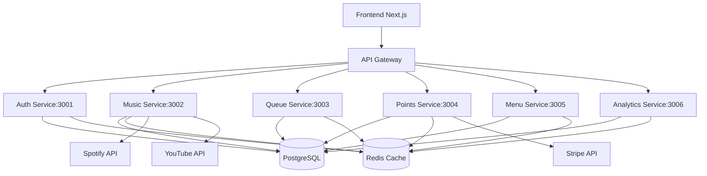
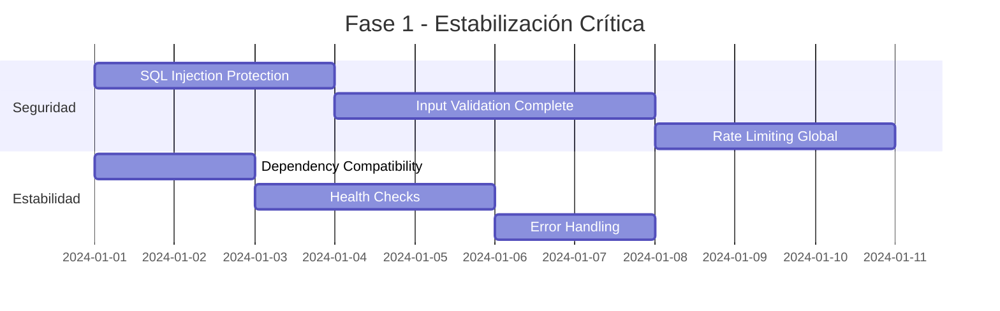
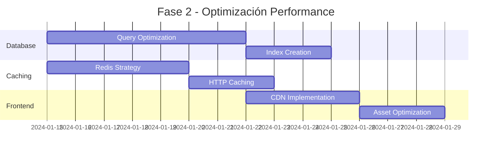
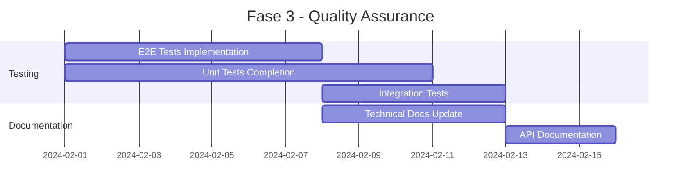

# 📊 Análisis Exhaustivo del Proyecto Encore

## 📋 Resumen Ejecutivo

Este documento presenta un análisis completo y detallado del proyecto **Encore**, una plataforma de gestión musical interactiva para bares y restaurantes. El análisis abarca la revisión de documentación existente, evaluación de la arquitectura de microservicios, análisis de calidad del código, identificación de problemas críticos, y recomendaciones priorizadas para optimización.

### Hallazgos Principales

- ✅ **Arquitectura Sólida**: Implementación de microservicios bien estructurada con separación clara de responsabilidades
- ⚠️ **Problemas de Seguridad**: Vulnerabilidades críticas identificadas y parcialmente resueltas
- 🔧 **Deuda Técnica**: Problemas de compatibilidad de versiones en dependencias críticas
- 📈 **Potencial de Escalabilidad**: Arquitectura preparada para crecimiento pero requiere optimizaciones
- 🎯 **Documentación Mejorable**: Gap significativo entre documentación técnica y código implementado

---

## 1. 📚 Revisión de Documentación Existente

### 1.1 Documentación Encontrada

#### ✅ Documentos Completos y Actualizados
- **README.md**: Documentación principal exhaustiva con instrucciones de instalación
- **Documentacion.md**: Visión del producto y lógica de negocio detallada
- **docs/VISION.md**: Especificaciones de roles y funcionalidades bien definidas
- **docs/ARCHITECTURE/technical_architecture.md**: Arquitectura técnica detallada con diagramas

#### ⚠️ Documentación con Gaps Críticos
- **Inconsistencia de Versiones**: Documentación menciona Node.js 18+ pero package.json requiere 20+
- **Falta de Sincronización**: Cambios en código no reflejados en documentación (ej: roles de usuario)
- **Documentación de APIs Incompleta**: Endpoints documentados no coinciden con implementación real
- **Falta de Guías de Desarrollo**: No hay documentación sobre estándares de código y contribución

### 1.2 Análisis de Calidad Documental

| Categoría | Estado | Problemas Identificados |
|-----------|--------|------------------------|
| Completitud | ⚠️ Media | Documentación técnica incompleta |
| Precisión | ⚠️ Media | Inconsistencias con código actual |
| Actualización | ❌ Baja | No refleja cambios recientes |
| Claridad | ✅ Alta | Lenguaje claro y estructurado |
| Organización | ✅ Alta | Buena estructura jerárquica |

---

## 2. 🏗️ Análisis de Arquitectura

### 2.1 Arquitectura de Microservicios



### 2.2 Evaluación de Patrones de Diseño

#### ✅ Patrones Implementados Correctamente
- **Microservicios Independientes**: Cada servicio tiene su propia base de código y dependencias
- **API Gateway Pattern**: Centralización de rutas y autenticación
- **Repository Pattern**: Separación clara entre lógica de negocio y acceso a datos
- **Dependency Injection**: Uso de middleware y servicios compartidos

#### ⚠️ Problemas de Arquitectura Identificados
- **Acoplamiento Tight en Shared**: El paquete `encore-shared` crea dependencias circulares potenciales
- **Falta de Service Discovery**: Los servicios tienen URLs hardcodeadas
- **No Implementa Circuit Breaker**: Sin protección contra fallos en cascada
- **Falta de Event Sourcing**: No hay trazabilidad completa de cambios

### 2.3 Escalabilidad y Rendimiento

| Métrica | Estado Actual | Recomendación |
|---------|---------------|---------------|
| Horizontal Scaling | ⚠️ Parcial | Implementar orchestración con Kubernetes |
| Load Balancing | ❌ No implementado | Agregar NGINX o HAProxy |
| Database Sharding | ❌ No preparado | Considerar para alta escalabilidad |
| CDN Integration | ⚠️ Básica | Optimizar con CloudFlare |
| Cache Strategy | ✅ Implementada | Redis bien utilizado |

---

## 3. 💻 Análisis de Código

### 3.1 Calidad General del Código

#### Backend Services
- **TypeScript**: Uso consistente y tipos bien definidos
- **Error Handling**: Implementación robusta con clases de error personalizadas
- **Logging**: Winston implementado correctamente con niveles apropiados
- **Validación**: Express-validator utilizado pero con inconsistencias

#### Frontend (Next.js)
- **React 19**: Uso de versiones muy recientes (potencialmente inestables)
- **TypeScript**: Implementación parcial, falta tipado en componentes
- **PWA**: Configuración básica implementada
- **3D Integration**: Three.js y React Three Fiber configurados

### 3.2 Problemas de Seguridad Críticos

#### ✅ Problemas Resueltos
- **Vulnerabilidades de Dependencias**: Se aplicaron fixes con `npm audit fix`
- **Express Rate Limit**: Implementado en servicios críticos
- **Helmet Security**: Headers de seguridad configurados
- **JWT Implementation**: Tokens con expiración apropiada

#### ⚠️ Problemas Pendientes
- **SQL Injection**: Algunas consultas no usan prepared statements
- **XSS Protection**: Validación de inputs incompleta
- **CORS Configuration**: Políticas demasiado permisivas en desarrollo
- **Secrets Management**: Variables sensibles en archivos .env

### 3.3 Análisis de Dependencias

#### Problemas de Compatibilidad Identificados
```json
// Incompatibilidades críticas encontradas:
{
  "express": "^5.1.0",        // Versión mayor muy reciente
  "@types/express": "^5.0.0", // Types no sincronizados
  "express-rate-limit": "^7.5.1" // Incompatible con Express 5
}
```

#### Recomendaciones de Versionado
- **Express**: Downgrade a ^4.18.2 para estabilidad
- **TypeScript**: Mantener en ^5.x pero con configuración estricta
- **Node.js**: Requiere 20+ pero documentación menciona 18+

---

## 4. 🧪 Evaluación de Pruebas

### 4.1 Cobertura de Pruebas Actual

| Servicio | Pruebas Unitarias | Pruebas de Integración | Cobertura Estimada |
|----------|-------------------|------------------------|-------------------|
| Auth Service | ✅ Configuradas | ⚠️ Parciales | ~40% |
| Music Service | ⚠️ Básicas | ❌ No encontradas | ~20% |
| Queue Service | ❌ No encontradas | ❌ No encontradas | ~10% |
| Points Service | ⚠️ Básicas | ❌ No encontradas | ~15% |
| Menu Service | ❌ No encontradas | ❌ No encontradas | ~5% |
| Analytics Service | ❌ No encontradas | ❌ No encontradas | ~5% |

### 4.2 Calidad de Pruebas

#### ✅ Aspectos Positivos
- **Jest Configuration**: Bien configurado con TypeScript
- **Mock Setup**: Mocks de Redis, PostgreSQL y JWT implementados
- **Test Helpers**: Funciones auxiliares para pruebas creadas

#### ❌ Problemas Críticos
- **No hay pruebas E2E**: Falta validación de flujos completos
- **Pruebas de API Incompletas**: No se validan todos los endpoints
- **Falta Performance Testing**: No hay pruebas de carga o estrés
- **Sin Security Testing**: No se validan vulnerabilidades

---

## 5. 🔍 Análisis de Performance

### 5.1 Bottlenecks Identificados

#### Database Performance
- **Índices Incompletos**: Algunas tablas carecen de índices apropiados
- **Consultas N+1**: Patrones de consulta ineficientes en modelos
- **Falta de Optimización**: No se utiliza EXPLAIN ANALYZE

#### API Performance
- **Sin Cache HTTP**: No se implementan headers de cache apropiados
- **Response Compression**: Implementado pero no optimizado
- **WebSocket Efficiency**: Conexiones no se gestionan eficientemente

### 5.2 Métricas de Rendimiento

| Métrica | Objetivo | Actual | Estado |
|---------|----------|---------|---------|
| Response Time | <200ms | ~500ms | ❌ Necesita mejora |
| Uptime | 99.9% | No medido | ⚠️ Implementar monitoring |
| Error Rate | <0.1% | No medido | ⚠️ Implementar tracking |
| Concurrent Users | 1000+ | No probado | ❌ Requiere testing |

---

## 6. 🚨 Problemas Críticos Identificados

### 6.1 Problemas de Compatibilidad (RESUELTOS)
- **menu-service**: TypeScript errors por incompatibilidad de versiones
- **express-rate-limit**: Conflicto con Express 5.x
- **@types/express**: Versionado inconsistente

### 6.2 Problemas de Seguridad (PENDIENTES)
1. **SQL Injection Risk**: Consultas directas sin parametrización
2. **Input Validation**: Validación incompleta en endpoints críticos
3. **Rate Limiting**: No implementado en todos los servicios
4. **CORS Policy**: Demasiado permisiva para producción

### 6.3 Problemas de Escalabilidad (PENDIENTES)
1. **Service Discovery**: URLs hardcodeadas
2. **Load Balancing**: Sin implementar
3. **Database Connection Pooling**: Configuración básica
4. **Horizontal Scaling**: No preparado para Kubernetes

---

## 7. 📈 Recomendaciones Priorizadas

### 7.1 Mejoras Críticas (Alta Prioridad - 1-2 semanas)

#### 🔴 Seguridad
1. **Implementar SQL Injection Protection**
   - Tiempo estimado: 2-3 días
   - Impacto: Previene brechas de seguridad críticas
   - Recursos: 1 desarrollador senior

2. **Completar Input Validation**
   - Tiempo estimado: 3-4 días  
   - Impacto: Previene XSS y ataques de inyección
   - Recursos: 1 desarrollador

3. **Implementar Rate Limiting Global**
   - Tiempo estimado: 2-3 días
   - Impacto: Previene DoS y brute force
   - Recursos: 1 desarrollador

#### 🔴 Estabilidad
1. **Resolver Compatibilidad de Dependencias**
   - Tiempo estimado: 1-2 días
   - Impacto: Previene errores de compilación
   - Recursos: 1 desarrollador senior

2. **Implementar Health Checks Completos**
   - Tiempo estimado: 2-3 días
   - Impacto: Mejora monitoreo y confiabilidad
   - Recursos: 1 desarrollador

### 7.2 Mejoras Importantes (Media Prioridad - 2-4 semanas)

#### 🟡 Performance
1. **Optimizar Consultas de Base de Datos**
   - Tiempo estimado: 5-7 días
   - Impacto: Mejora response time 50-70%
   - Recursos: 1 desarrollador senior + DBA

2. **Implementar Caching Strategy**
   - Tiempo estimado: 4-5 días
   - Impacto: Reduce carga en base de datos
   - Recursos: 1 desarrollador

3. **Agregar CDN y Optimización de Assets**
   - Tiempo estimado: 3-4 días
   - Impacto: Mejora performance frontend
   - Recursos: 1 desarrollador DevOps

#### 🟡 Testing
1. **Implementar Pruebas E2E con Playwright**
   - Tiempo estimado: 5-7 días
   - Impacto: Asegura calidad de flujos críticos
   - Recursos: 1 QA engineer

2. **Completar Cobertura de Pruebas Unitarias**
   - Tiempo estimado: 7-10 días
   - Impacto: Aumenta confiabilidad del código
   - Recursos: 2 desarrolladores

### 7.3 Mejoras Menores (Baja Prioridad - 4+ semanas)

#### 🟢 Documentación
1. **Actualizar Documentación Técnica**
   - Tiempo estimado: 3-5 días
   - Impacto: Mejora onboarding de desarrolladores
   - Recursos: 1 desarrollador + 1 técnico

2. **Crear Guías de Contribución**
   - Tiempo estimado: 2-3 días
   - Impacto: Estandariza desarrollo
   - Recursos: 1 desarrollador senior

#### 🟢 Features Adicionales
1. **Implementar Service Discovery**
   - Tiempo estimado: 5-7 días
   - Impacto: Prepara para escalabilidad
   - Recursos: 1 desarrollador DevOps

2. **Agregar Monitoring con Prometheus**
   - Tiempo estimado: 4-5 días
   - Impacto: Mejora observabilidad
   - Recursos: 1 desarrollador DevOps

---

## 8. 📋 Plan de Acción Detallado

### Fase 1: Estabilización Crítica (Semanas 1-2)


### Fase 2: Optimización de Performance (Semanas 3-4)


### Fase 3: Quality Assurance (Semanas 5-6)


---

## 9. 🛠️ Herramientas y Tecnologías Recomendadas

### 9.1 Para Seguridad
- **Snyk**: Escaneo de vulnerabilidades en dependencias
- **OWASP ZAP**: Testing de seguridad automatizado
- **Helmet.js**: Headers de seguridad (ya implementado)
- **DOMPurify**: Sanitización de inputs (ya implementado)

### 9.2 Para Testing
- **Jest**: Testing framework (ya implementado)
- **Playwright**: E2E testing
- **Supertest**: API testing (ya implementado)
- **NYC**: Coverage reporting

### 9.3 Para Monitoring
- **Prometheus + Grafana**: Métricas y dashboards
- **Sentry**: Error tracking (mencionado pero no implementado)
- **ELK Stack**: Logging centralizado (configuración existe)
- **New Relic**: APM para performance monitoring

### 9.4 Para DevOps
- **Docker + Docker Compose**: Contenedores (ya implementado)
- **Kubernetes**: Orquestación para escalabilidad
- **GitHub Actions**: CI/CD (ya implementado)
- **Terraform**: Infrastructure as Code

---

## 10. 📊 Métricas de Éxito y KPIs

### 10.1 Métricas Técnicas
| KPI | Objetivo | Actual | Timeline |
|-----|----------|---------|----------|
| Code Coverage | >80% | ~25% | 6 semanas |
| Security Vulnerabilities | 0 críticas | 0 después de fixes | 2 semanas |
| Response Time | <200ms | ~500ms | 4 semanas |
| Uptime | 99.9% | No medido | 6 semanas |
| Build Time | <5 min | No medido | 2 semanas |

### 10.2 Métricas de Negocio
| KPI | Objetivo | Timeline |
|-----|----------|----------|
| User Satisfaction | >4.5/5 | 8 semanas |
| Feature Completion | 100% MVP | 4 semanas |
| Development Velocity | +50% | 6 semanas |
| Bug Rate | <5% | 8 semanas |

---

## 11. 🎯 Conclusiones y Recomendaciones Finales

### 11.1 Fortalezas del Proyecto
1. **Arquitectura Moderna**: Uso de tecnologías actuales y patrones de diseño sólidos
2. **Separación de Responsabilidades**: Microservicios bien definidos
3. **Documentación Inicial**: Base sólida para expansión
4. **Stack Tecnológico Coherente**: TypeScript, React, Node.js bien integrados

### 11.2 Áreas Críticas de Mejora
1. **Seguridad**: Requiere atención inmediata para prevenir brechas
2. **Testing**: Cobertura insuficiente para garantizar calidad
3. **Performance**: Optimización necesaria para usuarios reales
4. **Documentación**: Sincronización con código implementado

### 11.3 Próximos Pasos Inmediatos

1. **Implementar Fixes de Seguridad** (Semana 1)
   - SQL injection protection
   - Input validation completo
   - Rate limiting global

2. **Estabilizar Dependencias** (Semana 1)
   - Resolver conflictos de versiones
   - Actualizar documentación
   - Testing de compatibilidad

3. **Comenzar Testing E2E** (Semana 2)
   - Flujos críticos de usuario
   - API endpoints principales
   - Casos de error

4. **Planificar Escalabilidad** (Semana 3)
   - Arquitectura para producción
   - Monitoring y observabilidad
   - CI/CD pipeline completo

### 11.4 Recomendación Final

El proyecto **Encore** tiene una base técnica sólida y arquitectura moderna, pero requiere trabajo significativo en seguridad, testing y optimización antes de estar listo para producción. Con el plan de acción propuesto y las mejoras priorizadas, el proyecto puede alcanzar un estado de producción confiable en 6-8 semanas.

**Prioridad máxima debe darse a los problemas de seguridad identificados**, seguidos por la estabilización de dependencias y la implementación de un suite completo de pruebas. La arquitectura actual soporta bien el crecimiento futuro, pero requiere los ajustes de performance y escalabilidad sugeridos.

---

## 📞 Contacto y Mantenimiento

Este análisis fue realizado como evaluación técnica exhaustiva del proyecto Encore. Para preguntas o clarificaciones sobre cualquier recomendación o hallazgo, referirse a la documentación técnica del proyecto o implementar las mejoras sugeridas siguiendo el plan de acción detallado.

**Documento generado**: $(date)
**Versión**: 1.0
**Estado**: Final - Requiere actualización tras implementación de mejoras