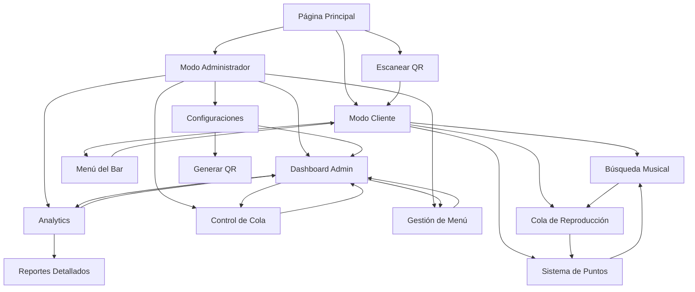

# Documento de Requisitos del Producto - Encore

## 1. Resumen del Producto

Encore es una plataforma de música interactiva para bares y restaurantes que permite a los clientes seleccionar y votar por la música que se reproduce en el establecimiento. Los usuarios pueden ganar y gastar puntos para influir en la cola de reproducción, creando una experiencia musical colaborativa y gamificada.

El producto resuelve el problema de la selección musical en establecimientos comerciales, permitiendo que los clientes participen activamente en la atmósfera musical mientras los propietarios mantienen el control sobre su establecimiento. Dirigido a bares, restaurantes, cafeterías y sus clientes, Encore transforma la experiencia musical de pasiva a interactiva.

El objetivo es crear una nueva categoría de entretenimiento social que incremente el tiempo de permanencia de los clientes y genere ingresos adicionales a través de la gamificación y el engagement.

## 2. Características Principales

### 2.1 Roles de Usuario

El sistema Encore implementa un sistema de roles unificado basado en constantes `UserRole` para garantizar consistencia y seguridad:

| Rol | Constante | Método de Registro | Permisos Principales |
|-----|-----------|-------------------|---------------------|
| **Invitado** | `UserRole.GUEST` | Acceso directo via QR sin registro | Puede ver la cola actual, información del bar, acceso limitado sin interacción |
| **Miembro** | `UserRole.MEMBER` | Registro por email o conversión desde invitado | Puede buscar música, agregar canciones a la cola, gastar puntos, ver menú, participar en gamificación |
| **Propietario de Bar** | `UserRole.BAR_OWNER` | Registro por email con verificación de negocio | Puede gestionar su bar, controlar la cola, ver analytics, gestionar menú, configurar sistema de puntos, generar códigos QR |
| **Super Administrador** | `UserRole.SUPER_ADMIN` | Invitación del sistema con permisos especiales | Acceso completo a todos los bares, usuarios, configuraciones globales, métricas del sistema, gestión de roles |

#### Jerarquía de Roles
```
SUPER_ADMIN > BAR_OWNER > MEMBER > GUEST
```

#### Flujos de Migración de Roles
- **GUEST → MEMBER**: Registro con email durante la sesión
- **MEMBER → BAR_OWNER**: Solicitud de verificación de negocio
- **BAR_OWNER → SUPER_ADMIN**: Solo por invitación del sistema

### 2.2 Módulos de Funcionalidades

Nuestros requisitos del producto consisten en las siguientes páginas principales:

1. **Página Principal**: selección de modo (cliente/administrador), información del bar, acceso rápido via QR.
2. **Interfaz de Cliente**: búsqueda de música, cola de reproducción en tiempo real, sistema de puntos, menú del bar.
3. **Panel de Administración**: dashboard con métricas, control de cola, gestión de menú, configuraciones del bar.
4. **Página de Analytics**: reportes detallados, métricas de uso, análisis de preferencias musicales.
5. **Generador QR**: códigos QR personalizados para acceso rápido de clientes.
6. **Modo Offline**: funcionalidad PWA para uso sin conexión.

### 2.3 Detalles de Páginas

| Nombre de Página | Nombre del Módulo | Descripción de Funcionalidad |
|------------------|-------------------|------------------------------|
| Página Principal | Selector de Modo | Permite elegir entre modo cliente y administrador. Muestra información básica del bar |
| Página Principal | Información del Bar | Muestra nombre, dirección, horarios y información relevante del establecimiento |
| Página Principal | Acceso QR | Permite escanear código QR para acceso rápido sin registro |
| Interfaz de Cliente | Búsqueda Musical | Buscar canciones por título, artista o álbum en múltiples fuentes (Spotify, YouTube, local) |
| Interfaz de Cliente | Cola de Reproducción | Ver canciones en cola, posición actual, tiempo estimado de espera, canción reproduciéndose |
| Interfaz de Cliente | Sistema de Puntos | Ver puntos disponibles, gastar puntos para prioridad, historial de transacciones |
| Interfaz de Cliente | Menú del Bar | Ver menú de comidas y bebidas, precios, disponibilidad |
| Panel de Administración | Dashboard Principal | Métricas en tiempo real, usuarios activos, canciones en cola, ingresos por puntos |
| Panel de Administración | Control de Cola | Saltar canciones, pausar/reanudar, reordenar cola, bloquear usuarios |
| Panel de Administración | Gestión de Menú | Agregar/editar/eliminar items del menú, gestionar precios y disponibilidad |
| Panel de Administración | Configuraciones | Ajustar límites de cola, precios de puntos, géneros permitidos, horarios |
| Página de Analytics | Reportes de Uso | Gráficos de uso por hora/día/semana, canciones más populares, usuarios más activos |
| Página de Analytics | Análisis Musical | Géneros preferidos, artistas populares, tendencias musicales |
| Página de Analytics | Métricas de Negocio | Ingresos por puntos, tiempo promedio de permanencia, conversión de usuarios |
| Generador QR | Códigos Personalizados | Generar QR para acceso directo, QR para mesas específicas, QR promocionales |
| Modo Offline | Cache Local | Funcionalidad básica sin conexión, sincronización al reconectar |
| Modo Offline | Notificaciones | Alertas push para cambios importantes, nuevas funcionalidades |

## 3. Proceso Principal

### Flujo de Cliente Regular:
1. El cliente escanea el código QR en la mesa o accede via web
2. Selecciona el modo "Cliente" en la página principal
3. Busca canciones usando la función de búsqueda
4. Agrega canciones a la cola (opcionalmente gastando puntos para prioridad)
5. Ve la cola en tiempo real y su posición
6. Gana puntos por tiempo de permanencia y interacciones
7. Puede ver el menú del bar y realizar pedidos

### Flujo de Propietario de Bar:
1. Inicia sesión en el panel de administración
2. Ve el dashboard con métricas en tiempo real
3. Controla la cola de reproducción (saltar, pausar, reordenar)
4. Gestiona el menú del establecimiento
5. Configura parámetros del sistema (límites, precios, géneros)
6. Revisa analytics y reportes de uso
7. Genera códigos QR personalizados para mesas

### Diagrama de Flujo de Navegación:



## 4. Diseño de Interfaz de Usuario

### 4.1 Estilo de Diseño

**Colores Principales:**
- Primario: #6366F1 (Índigo vibrante)
- Secundario: #EC4899 (Rosa energético)
- Acento: #F59E0B (Amarillo dorado)
- Fondo: #0F172A (Azul oscuro)
- Texto: #F8FAFC (Blanco suave)

**Estilo de Botones:**
- Botones principales: Redondeados con gradiente y efecto hover
- Botones secundarios: Outline con bordes redondeados
- Botones de acción: Efecto 3D sutil con sombras

**Tipografía:**
- Fuente principal: Inter (sans-serif moderna)
- Títulos: 24px-32px, peso 700
- Subtítulos: 18px-20px, peso 600
- Texto normal: 14px-16px, peso 400

**Estilo de Layout:**
- Diseño basado en cards con sombras suaves
- Navegación superior fija con menú hamburguesa en móvil
- Grid responsivo con breakpoints estándar
- Animaciones suaves con Framer Motion

**Iconos y Emojis:**
- Iconos: Lucide React (consistentes y modernos)
- Emojis: 🎵 para música, 🏆 para puntos, 📊 para analytics
- Estilo minimalista con líneas finas

### 4.2 Resumen de Diseño de Páginas

| Nombre de Página | Nombre del Módulo | Elementos de UI |
|------------------|-------------------|----------------|
| Página Principal | Hero Section | Logo grande centrado, gradiente de fondo, botones CTA prominentes con animaciones hover |
| Página Principal | Selector de Modo | Cards grandes con iconos, colores diferenciados (azul para cliente, verde para admin) |
| Interfaz de Cliente | Búsqueda Musical | Barra de búsqueda con autocompletado, filtros por fuente, resultados en grid de cards |
| Interfaz de Cliente | Cola de Reproducción | Lista vertical con drag-and-drop, indicadores de posición, timer en tiempo real |
| Interfaz de Cliente | Sistema de Puntos | Contador animado, botones de gasto, historial en modal, badges de nivel |
| Panel de Administración | Dashboard | Grid de métricas con números grandes, gráficos coloridos, indicadores de estado |
| Panel de Administración | Control de Cola | Lista con controles inline, botones de acción rápida, confirmaciones modales |
| Analytics | Reportes | Gráficos interactivos con Chart.js, filtros de fecha, exportación PDF |
| Generador QR | Códigos | Preview del QR en tiempo real, opciones de personalización, descarga directa |

### 4.3 Responsividad

**Estrategia Mobile-First:**
- Diseño optimizado primero para móviles (320px+)
- Adaptación progresiva para tablets (768px+) y desktop (1024px+)
- Navegación touch-friendly con botones de mínimo 44px
- Gestos swipe para navegación entre secciones
- PWA optimizada para instalación en dispositivos móviles

**Breakpoints:**
- Mobile: 320px - 767px
- Tablet: 768px - 1023px
- Desktop: 1024px+
- Large Desktop: 1440px+

**Optimizaciones Touch:**
- Botones grandes y espaciados
- Scroll suave y natural
- Feedback haptic en dispositivos compatibles
- Gestos intuitivos para acciones comunes

## 5. Funcionalidades Técnicas Clave

### 5.1 Progressive Web App (PWA)
- Instalación nativa en dispositivos
- Funcionamiento offline básico
- Notificaciones push
- Sincronización en background
- Cache inteligente de contenido

### 5.2 Tiempo Real
- WebSockets para actualizaciones instantáneas
- Sincronización de cola entre todos los clientes
- Notificaciones en vivo de cambios
- Estado compartido entre dispositivos

### 5.3 Gamificación
- Sistema de puntos dinámico
- Niveles y badges de usuario
- Leaderboards por bar
- Recompensas y promociones
- Challenges semanales

### 5.4 Integraciones Externas
- Spotify Web API para catálogo musical
- YouTube Data API para videos musicales
- Stripe para procesamiento de pagos
- APIs de mapas para localización

### 5.5 Analytics Avanzados
- Tracking de comportamiento de usuario
- Métricas de engagement
- Análisis de preferencias musicales
- Reportes automatizados
- Dashboards personalizables

## 6. Criterios de Aceptación

### 6.1 Funcionalidad Core
- ✅ Los usuarios pueden buscar y agregar canciones a la cola
- ✅ La cola se actualiza en tiempo real para todos los usuarios
- ✅ El sistema de puntos funciona correctamente
- ✅ Los propietarios pueden controlar la reproducción
- ✅ La PWA se instala y funciona offline

### 6.2 Rendimiento
- ⏱️ Tiempo de carga inicial < 3 segundos
- ⏱️ Actualizaciones en tiempo real < 500ms
- ⏱️ Búsqueda de canciones < 1 segundo
- 📱 Funciona en dispositivos con 2GB RAM
- 🌐 Funciona con conexiones 3G

### 6.3 Usabilidad
- 👥 Interfaz intuitiva sin necesidad de tutorial
- 📱 Completamente responsive en todos los dispositivos
- ♿ Accesible según estándares WCAG 2.1
- 🌍 Soporte para múltiples idiomas
- 🎨 Diseño consistente en toda la aplicación

### 6.4 Seguridad
- 🔐 Autenticación segura con JWT
- 🛡️ Validación de entrada en todos los endpoints
- 🚫 Rate limiting para prevenir abuso
- 🔒 Datos sensibles encriptados
- 📋 Logs de auditoría para acciones críticas

## 7. Roadmap de Funcionalidades

### Fase 1: MVP (Semanas 1-4)
- ✅ Autenticación básica
- ✅ Búsqueda y cola de música
- ✅ Sistema de puntos básico
- ✅ Panel de administración
- ✅ PWA básica

### Fase 2: Mejoras Core (Semanas 5-8)
- 🔄 Integraciones con Spotify/YouTube
- 📊 Analytics básicos
- 🎮 Gamificación avanzada
- 💳 Sistema de pagos
- 🔔 Notificaciones push

### Fase 3: Funcionalidades Avanzadas (Semanas 9-12)
- 🤖 Recomendaciones con IA
- 📱 App móvil nativa
- 🏪 Marketplace de bares
- 🎉 Eventos y promociones
- 📈 Analytics avanzados

### Fase 4: Escalabilidad (Semanas 13-16)
- ☁️ Migración a microservicios
- 🌍 Soporte multi-región
- 🔧 API pública para terceros
- 📊 Business Intelligence
- 🤝 Integraciones con POS

## 8. Métricas de Éxito

### 8.1 Métricas de Usuario
- **Usuarios Activos Diarios (DAU):** >1000 usuarios/día
- **Tiempo de Sesión Promedio:** >15 minutos
- **Retención 7 días:** >40%
- **Canciones Agregadas por Sesión:** >3
- **Puntos Gastados por Usuario:** >50/semana

### 8.2 Métricas de Negocio
- **Bares Activos:** >50 establecimientos
- **Ingresos por Puntos:** >$5000/mes
- **Tiempo de Permanencia en Bares:** +25%
- **Satisfacción del Cliente:** >4.5/5
- **NPS (Net Promoter Score):** >50

### 8.3 Métricas Técnicas
- **Uptime:** >99.9%
- **Tiempo de Respuesta API:** <200ms
- **Error Rate:** <0.1%
- **PWA Install Rate:** >30%
- **Offline Usage:** >10% del tiempo total

## 9. Consideraciones Futuras

### 9.1 Escalabilidad
- Arquitectura preparada para millones de usuarios
- CDN global para contenido estático
- Base de datos distribuida
- Cache distribuido con Redis Cluster
- Load balancing automático

### 9.2 Monetización
- Freemium con límites de canciones
- Suscripciones premium para bares
- Comisiones por ventas de menú
- Publicidad contextual
- Partnerships con plataformas musicales

### 9.3 Expansión
- Soporte para eventos y festivales
- Integración con sistemas de karaoke
- Funcionalidades de DJ virtual
- Marketplace de música independiente
- Plataforma de descubrimiento musical