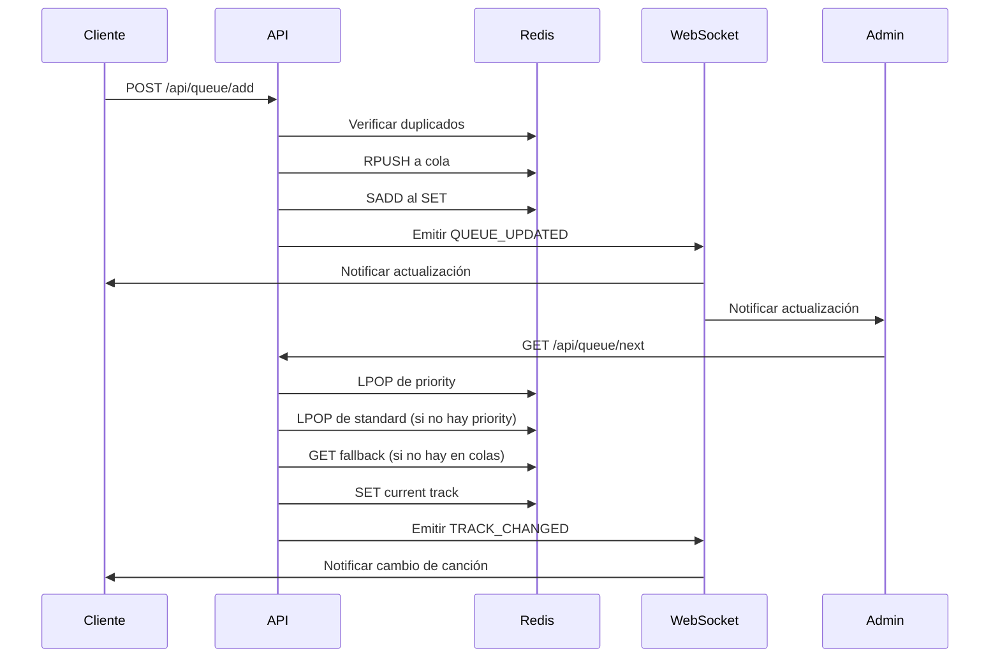

# Motor de Cola Musical Interactiva - Documentación Técnica (Fase 2)

## 1. Resumen Ejecutivo

El Motor de Cola Musical es el núcleo transaccional de Encore que transforma la selección pasiva de música en un mercado activo donde los usuarios compiten por "tiempo de aire" mediante el gasto de puntos. El sistema implementa una arquitectura de baja latencia basada en Redis y WebSockets para garantizar actualizaciones instantáneas y continuidad del servicio.

### Principios Rectores
- **Latencia Cero**: Actualizaciones instantáneas mediante WebSockets + Redis
- **Monetización Implícita**: Arquitectura que favorece canciones "Premium" sin comprometer la experiencia gratuita
- **Continuidad**: El sistema nunca debe quedarse en silencio mediante fallback automático

## 2. Arquitectura de Datos (Redis)

### 2.1 Estructuras de Datos

Redis actúa como fuente única de verdad para el estado activo de la cola:

| Clave Redis | Tipo | Descripción | Operaciones |
|-------------|------|-------------|-------------|
| `queue:{barId}:current` | STRING (JSON) | Metadatos de la canción actual | SET, GET |
| `queue:{barId}:priority` | LIST | Cola VIP - canciones premium | RPUSH (añadir), LPOP (reproducir) |
| `queue:{barId}:standard` | LIST | Cola regular - canciones estándar | RPUSH (añadir), LPOP (reproducir) |
| `queue:{barId}:set` | SET | Conjunto de videoIds activos (prevención duplicados) | SADD, SISMEMBER, SREM |

### 2.2 Formato de Datos JSON

```json
// Estructura de Track
{
  "videoId": "dQw4w9WgXcQ",
  "title": "Never Gonna Give You Up",
  "artist": "Rick Astley",
  "thumbnail": "https://i.ytimg.com/vi/dQw4w9WgXcQ/default.jpg",
  "duration": "213",
  "userId": "user-123",
  "userName": "Juan Pérez",
  "type": "priority|standard",
  "points": 50,
  "addedAt": "2024-01-15T10:30:00Z"
}
```

## 3. Algoritmo "Next Track Engine"

### 3.1 Implementación

```typescript
interface Track {
  videoId: string;
  title: string;
  artist: string;
  thumbnail: string;
  duration: number;
  source: 'priority' | 'standard' | 'fallback';
}

async function getNextTrack(barId: string): Promise<Track | null> {
  const redis = getRedisClient();
  
  // 1. Intentar obtener de cola PRIORITARIA
  let nextTrackData = await redis.lpop(`queue:${barId}:priority`);
  let source: 'priority' | 'standard' | 'fallback' = 'priority';
  
  // 2. Si no hay prioritaria, intentar cola ESTÁNDAR
  if (!nextTrackData) {
    nextTrackData = await redis.lpop(`queue:${barId}:standard`);
    source = 'standard';
  }
  
  // 3. Activar MODO FALLBACK si no hay canciones
  if (!nextTrackData) {
    nextTrackData = await fallbackService.getRandomBaseTrack(barId);
    source = 'fallback';
  }
  
  // 4. Actualizar estado y notificar
  if (nextTrackData) {
    const track: Track = {
      ...JSON.parse(nextTrackData),
      source
    };
    
    await redis.set(`queue:${barId}:current`, JSON.stringify(track));
    
    // Eliminar del SET de duplicados si no es fallback
    if (source !== 'fallback') {
      await redis.srem(`queue:${barId}:set`, track.videoId);
    }
    
    // Notificar a todos los clientes del bar
    socketService.emitToBar(barId, 'TRACK_CHANGED', track);
  }
  
  return nextTrackData ? JSON.parse(nextTrackData) : null;
}
```

### 3.2 Servicio de Fallback

```typescript
class FallbackService {
  async getRandomBaseTrack(barId: string): Promise<string> {
    const query = `
      SELECT video_id, title, artist, thumbnail, duration 
      FROM bar_base_playlists 
      WHERE bar_id = $1 
      ORDER BY RANDOM() 
      LIMIT 1
    `;
    
    const result = await pool.query(query, [barId]);
    
    if (result.rows.length === 0) {
      // Playlist genérica de respaldo
      return JSON.stringify({
        videoId: "default-track",
        title: "Música de Ambiente",
        artist: "Encore",
        thumbnail: "/default-thumbnail.jpg",
        duration: 180,
        source: 'fallback'
      });
    }
    
    return JSON.stringify({
      ...result.rows[0],
      source: 'fallback'
    });
  }
}
```

## 4. Sistema de Conexión por QRs

### 4.1 Generación de QR (Admin)

```typescript
// Endpoint: POST /api/admin/tables/generate-qr
interface GenerateQRRequest {
  barId: string;
  tableNumber: number;
  tableName?: string;
}

interface GenerateQRResponse {
  tableId: string;
  qrCode: string; // Base64 encoded QR image
  url: string;
}

async function generateQR(req: GenerateQRRequest): Promise<GenerateQRResponse> {
  const tableId = uuidv4();
  const url = `https://encore.app/c?b=${req.barId}&t=${tableId}`;
  
  // Generar QR code
  const qrCode = await QRCode.toDataURL(url, {
    width: 300,
    margin: 2,
    color: {
      dark: '#000000',
      light: '#FFFFFF'
    }
  });
  
  // Guardar mesa en base de datos
  await pool.query(
    'INSERT INTO tables (id, bar_id, table_number, name, qr_url) VALUES ($1, $2, $3, $4, $5)',
    [tableId, req.barId, req.tableNumber, req.tableName || `Mesa ${req.tableNumber}`, url]
  );
  
  return {
    tableId,
    qrCode,
    url
  };
}
```

### 4.2 Procesamiento de QR (Cliente)

```typescript
// Middleware de Next.js para manejar URLs con parámetros
export function middleware(request: NextRequest) {
  const { searchParams } = new URL(request.url);
  const barId = searchParams.get('b');
  const tableId = searchParams.get('t');
  
  if (barId) {
    // Guardar en cookies para persistencia
    const response = NextResponse.next();
    response.cookies.set('encore_bar_id', barId, {
      maxAge: 60 * 60 * 24 * 7, // 7 días
      httpOnly: false,
      secure: true,
      sameSite: 'lax'
    });
    
    if (tableId) {
      response.cookies.set('encore_table_id', tableId, {
        maxAge: 60 * 60 * 24 * 7,
        httpOnly: false,
        secure: true,
        sameSite: 'lax'
      });
    }
    
    return response;
  }
  
  return NextResponse.next();
}
```

## 5. Plan de Implementación Detallado

### Fase 1: Servicio de Música (Buscador)

**Objetivo**: Implementar búsqueda de canciones mediante YouTube Data API

**Endpoints**:
```
GET /api/music/search?q={query}&maxResults=10
Headers: Authorization: Bearer {token}
```

**Respuesta**:
```json
{
  "results": [
    {
      "videoId": "dQw4w9WgXcQ",
      "title": "Rick Astley - Never Gonna Give You Up (Official Video)",
      "thumbnail": "https://i.ytimg.com/vi/dQw4w9WgXcQ/default.jpg",
      "duration": "213",
      "channel": "RickAstleyVEVO"
    }
  ]
}
```

### Fase 2: Servicio de Cola (Motor Redis)

**Objetivo**: Implementar estructura básica de colas en Redis

**Endpoints**:
```
POST /api/queue/add
Content-Type: application/json

{
  "barId": "uuid-del-bar",
  "videoId": "dQw4w9WgXcQ",
  "type": "standard|priority",
  "points": 50
}
```

**Lógica de validación**:
```typescript
async function addToQueue(trackData: TrackData): Promise<QueueResponse> {
  const redis = getRedisClient();
  
  // Verificar duplicados
  const isDuplicate = await redis.sismember(
    `queue:${trackData.barId}:set`, 
    trackData.videoId
  );
  
  if (isDuplicate) {
    throw new Error('Canción ya en cola');
  }
  
  // Crear objeto track
  const track = {
    videoId: trackData.videoId,
    title: trackData.title,
    thumbnail: trackData.thumbnail,
    duration: trackData.duration,
    userId: trackData.userId,
    points: trackData.points,
    addedAt: new Date().toISOString()
  };
  
  // Añadir a la cola correspondiente
  const queueKey = `queue:${trackData.barId}:${trackData.type}`;
  await redis.rpush(queueKey, JSON.stringify(track));
  
  // Añadir al SET de duplicados
  await redis.sadd(`queue:${trackData.barId}:set`, trackData.videoId);
  
  // Emitir evento WebSocket
  socketService.emitToBar(trackData.barId, 'QUEUE_UPDATED', {
    type: trackData.type,
    track
  });
  
  return { success: true, position: await redis.llen(queueKey) };
}
```

### Fase 3: Frontend Cliente (Interfaz de Búsqueda)

**Ruta**: `/client/music`

**Componentes principales**:
- SearchBar: Input de búsqueda con debounce
- ResultsList: Lista de resultados de búsqueda
- QueueDisplay: Visualización de la cola actual
- AddButton: Botón para añadir canciones

**Estado con Zustand**:
```typescript
interface MusicStore {
  barId: string | null;
  tableId: string | null;
  searchResults: Track[];
  currentQueue: Track[];
  isLoading: boolean;
  
  searchTracks: (query: string) => Promise<void>;
  addToQueue: (track: Track, type: 'standard' | 'priority') => Promise<void>;
  connectToWebSocket: () => void;
}
```

### Fase 4: Frontend Admin (Reproductor)

**Ruta**: `/admin/player`

**Componentes principales**:
- YouTubePlayer: Wrapper de react-player
- QueueManager: Gestión de colas
- CurrentTrack: Información de canción actual
- Controls: Play, pause, skip, volumen

**Integración con YouTube**:
```typescript
import ReactPlayer from 'react-player/youtube';

function AdminPlayer() {
  const [currentTrack, setCurrentTrack] = useState<Track | null>(null);
  const [isPlaying, setIsPlaying] = useState(false);
  
  useEffect(() => {
    // Obtener canción actual
    fetchCurrentTrack();
    
    // Conectar WebSocket para actualizaciones
    const ws = new WebSocket(`${WS_URL}/admin`);
    
    ws.onmessage = (event) => {
      const data = JSON.parse(event.data);
      if (data.type === 'TRACK_CHANGED') {
        setCurrentTrack(data.track);
        setIsPlaying(true);
      }
    };
  }, []);
  
  const handleEnded = async () => {
    // Solicitar siguiente canción
    const response = await fetch('/api/queue/next', {
      method: 'POST',
      headers: { 'Content-Type': 'application/json' },
      body: JSON.stringify({ barId: getBarId() })
    });
    
    if (response.ok) {
      const { track } = await response.json();
      setCurrentTrack(track);
    }
  };
  
  return (
    <ReactPlayer
      url={currentTrack ? `https://www.youtube.com/watch?v=${currentTrack.videoId}` : null}
      playing={isPlaying}
      onEnded={handleEnded}
      width="100%"
      height="100%"
      controls={true}
    />
  );
}
```

### Fase 5: WebSockets (Actualización en Tiempo Real)

**Configuración del servidor**:
```typescript
import { Server } from 'socket.io';

const io = new Server(server, {
  cors: {
    origin: ["http://localhost:3000", "http://localhost:3004"],
    methods: ["GET", "POST"]
  }
});

io.on('connection', (socket) => {
  const { barId, userType } = socket.handshake.query;
  
  // Unir a sala del bar
  socket.join(`bar:${barId}`);
  
  if (userType === 'admin') {
    socket.join(`bar:${barId}:admin`);
  }
  
  socket.on('QUEUE_UPDATED', (data) => {
    // Notificar a todos los clientes del bar
    io.to(`bar:${barId}`).emit('QUEUE_UPDATED', data);
  });
  
  socket.on('TRACK_CHANGED', (data) => {
    // Notificar cambio de canción
    io.to(`bar:${barId}`).emit('TRACK_CHANGED', data);
  });
});
```

## 6. Consideraciones de Seguridad y Rendimiento

### 6.1 Seguridad
- **Rate Limiting**: Máximo 5 canciones por usuario por hora
- **Validación de puntos**: Verificar saldo antes de añadir canciones premium
- **Sanitización**: Limpiar metadatos de YouTube antes de almacenar
- **Autenticación**: JWT tokens para todas las operaciones

### 6.2 Rendimiento
- **Pipeline Redis**: Usar pipelines para operaciones múltiples
- **Cache de búsquedas**: Cachear resultados de búsqueda por 5 minutos
- **Conexiones persistentes**: Mantener conexiones WebSocket abiertas
- **Índices PostgreSQL**: Crear índices en bar_id, video_id

### 6.3 Monitoreo
```typescript
// Métricas clave a monitorear
interface QueueMetrics {
  queueSize: number;
  priorityRatio: number;
  averageWaitTime: number;
  fallbackUsage: number;
  errorRate: number;
}
```

## 7. Diagrama de Flujo de Datos



## 8. Endpoints API Completos

### Gestión de Colas
- `POST /api/queue/add` - Añadir canción a la cola
- `GET /api/queue/status/:barId` - Obtener estado actual de la cola
- `POST /api/queue/next` - Obtener siguiente canción (admin)
- `DELETE /api/queue/remove/:barId/:videoId` - Eliminar canción de la cola

### Gestión de Música
- `GET /api/music/search?q={query}` - Buscar canciones en YouTube
- `GET /api/music/track/:videoId` - Obtener detalles de una canción

### Gestión de Mesas
- `POST /api/admin/tables/generate-qr` - Generar QR para mesa
- `GET /api/admin/tables/:barId` - Listar mesas del bar
- `DELETE /api/admin/tables/:tableId` - Eliminar mesa

Este documento técnico proporciona la base completa para implementar el Motor de Cola Musical Interactiva de Encore con todas las consideraciones de arquitectura, seguridad y rendimiento necesarias.