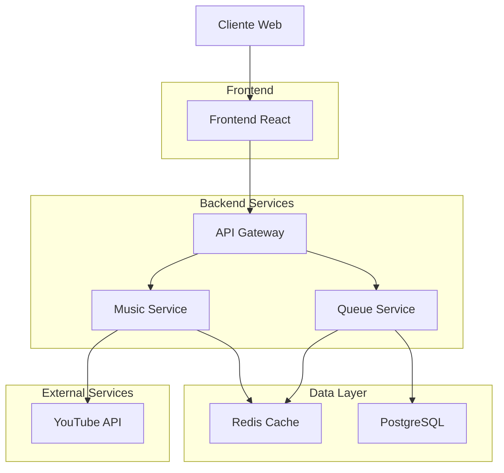

# Especificación Técnica: Funcionalidad de Cola de Reproducción con YouTube API

## 1. Visión General del Proyecto

Esta implementación añade una funcionalidad completa de cola de reproducción musical utilizando la API de YouTube al sistema Encore. La solución aborda los desafíos críticos de cuota de API, rendimiento y sincronización en tiempo real entre múltiples establecimientos.

### Problemas a Resolver:
- **Cuota limitada de YouTube**: Solo 10,000 unidades diarias (100 búsquedas = 1,000 unidades)
- **Sincronización en tiempo real**: Múltiples usuarios necesitan ver la misma cola simultáneamente
- **Persistencia y rendimiento**: La cola debe ser rápida y sobrevivir a reinicios

### Valor del Producto:
- Experiencia musical interactiva para bares y restaurantes
- Gestión eficiente de cuotas de API mediante caché inteligente
- Arquitectura escalable para múltiples establecimientos

## 2. Arquitectura de la Solución

### 2.1 Diagrama de Arquitectura



### 2.2 Decisiones Técnicas Clave

#### ¿Por qué Redis para la cola en lugar de localStorage o PostgreSQL?

**vs localStorage:**
- ❌ El dispositivo del DJ puede reiniciarse o cambiar de navegador
- ❌ Los clientes no pueden ver la cola en tiempo real
- ❌ No hay sincronización entre dispositivos

**vs PostgreSQL:**
- ❌ Muy lento para operaciones que cambian cada segundo
- ❌ No está diseñado para estructuras de lista dinámicas
- ❌ Latencia alta para lecturas/escrituras frecuentes

**✅ Redis:**
- ⚡ Ultrarrápido para operaciones de lista (LPUSH, RPOP, LRANGE)
- 🔄 Compartido entre todos los usuarios en tiempo real
- 💾 Sobrevive a reinicios de microservicios
- 📊 Ideal para estructuras de cola

## 3. Implementación por Fases

### Fase 1: Motor de Búsqueda (Music Service)

#### Objetivo
Implementar búsqueda de música con caché agresivo para optimizar el uso de cuota de YouTube API.

#### Endpoints

**GET /api/music/search?query={search_term}&bar_id={bar_id}**

**Parámetros:**
- `query` (string, requerido): Término de búsqueda
- `bar_id` (string, requerido): ID del establecimiento

**Respuesta exitosa (200):**
```json
{
  "results": [
    {
      "videoId": "dQw4w9WgXcQ",
      "title": "Rick Astley - Never Gonna Give You Up",
      "channel": "RickAstleyVEVO",
      "duration": "3:32",
      "thumbnail": "https://i.ytimg.com/vi/dQw4w9WgXcQ/default.jpg",
      "viewCount": "1000000000"
    }
  ],
  "cached": true,
  "quota_used": 0
}
```

**Implementación del Caché:**
```typescript
// Clave de caché: search:${query}
// Expiración: 24 horas
// Valor: Array de resultados de búsqueda

const searchCacheKey = `search:${query.toLowerCase().trim()}`;
const cachedResults = await redis.get(searchCacheKey);

if (cachedResults) {
  return JSON.parse(cachedResults);
}

// Si no hay caché, hacer petición a YouTube API
const youtubeResults = await youtube.search.list({
  q: query,
  part: 'snippet',
  type: 'video',
  maxResults: 10
});

// Guardar en caché por 24 horas
await redis.setex(searchCacheKey, 86400, JSON.stringify(formattedResults));
```

#### Estrategia de Cuota
- **Cuota diaria**: 10,000 unidades
- **Costo por búsqueda**: 100 unidades
- **Máximo sin caché**: 100 búsquedas/día para TODA la plataforma
- **Con caché**: Potencialmente ilimitadas si se repiten búsquedas

### Fase 2: Cola Compartida (Queue Service)

#### Objetivo
Gestionar la cola de reproducción compartida entre todos los usuarios del establecimiento.

#### Estructura de Redis
```
// Clave: queue:{bar_id}
// Tipo: Lista de Redis
// Operaciones: RPUSH (añadir al final), LPOP (quitar del principio)

queue:bar_123 = [
  {
    "videoId": "abc123",
    "title": "Canción 1",
    "addedBy": "user_456",
    "addedAt": "2024-01-15T10:30:00Z"
  },
  {
    "videoId": "def456", 
    "title": "Canción 2",
    "addedBy": "user_789",
    "addedAt": "2024-01-15T10:32:00Z"
  }
]
```

#### Endpoints

**POST /api/queue/add**

**Body:**
```json
{
  "bar_id": "bar_123",
  "video_id": "abc123",
  "title": "Canción",
  "user_id": "user_456"
}
```

**GET /api/queue?bar_id={bar_id}**

**Respuesta:**
```json
{
  "queue": [
    {
      "videoId": "abc123",
      "title": "Canción actual",
      "addedBy": "user_456",
      "addedAt": "2024-01-15T10:30:00Z",
      "position": 0
    }
  ],
  "current_song": {
    "videoId": "current123",
    "startTime": "2024-01-15T10:30:00Z",
    "elapsedSeconds": 45
  }
}
```

#### Implementación de Redis
```typescript
// Añadir a la cola
await redis.rpush(`queue:${bar_id}`, JSON.stringify(songData));

// Obtener cola completa
const queueData = await redis.lrange(`queue:${bar_id}`, 0, -1);
const queue = queueData.map(item => JSON.parse(item));

// Siguiente canción
const nextSong = await redis.lpop(`queue:${bar_id}`);
```

### Fase 3: Reproductor (Frontend)

#### Tecnología: react-player

**Ventajas de react-player:**
- ✅ Manejo automático de casos borde de YouTube
- ✅ Soporte para múltiples proveedores
- ✅ Controles personalizables
- ✅ Manejo de errores robusto
- ✅ Soporte para reproducción en segundo plano

#### Componente Principal
```typescript
import ReactPlayer from 'react-player/youtube';

const MusicPlayer: React.FC = () => {
  const [currentSong, setCurrentSong] = useState(null);
  const [queue, setQueue] = useState([]);
  const [isPlaying, setIsPlaying] = useState(false);

  // Obtener cola cada 5 segundos
  useEffect(() => {
    const fetchQueue = async () => {
      const response = await fetch(`/api/queue?bar_id=${barId}`);
      const data = await response.json();
      setQueue(data.queue);
      setCurrentSong(data.current_song);
    };

    fetchQueue();
    const interval = setInterval(fetchQueue, 5000);
    return () => clearInterval(interval);
  }, []);

  // Auto-reproducción siguiente canción
  const handleSongEnd = async () => {
    await fetch('/api/queue/next', { method: 'POST' });
    // Recargar cola
  };

  return (
    <ReactPlayer
      url={`https://www.youtube.com/watch?v=${currentSong?.videoId}`}
      playing={isPlaying}
      onEnded={handleSongEnd}
      width="100%"
      height="100%"
      controls={true}
      config={{
        youtube: {
          playerVars: {
            autoplay: 1,
            modestbranding: 1,
            rel: 0
          }
        }
      }}
    />
  );
};
```

## 4. Diseño Responsive

### Mobile-First Approach
```css
/* Mobile (320px - 768px) */
.player-container {
  width: 100%;
  height: 200px;
}

.queue-item {
  padding: 12px;
  font-size: 14px;
}

/* Tablet (768px - 1024px) */
@media (min-width: 768px) {
  .player-container {
    height: 300px;
  }
  
  .queue-item {
    padding: 16px;
    font-size: 16px;
  }
}

/* Desktop (1024px+) */
@media (min-width: 1024px) {
  .player-container {
    height: 400px;
  }
  
  .main-layout {
    display: grid;
    grid-template-columns: 2fr 1fr;
    gap: 24px;
  }
}
```

## 5. Manejo de Errores

### Errores de YouTube API
```typescript
try {
  const results = await youtube.search.list(params);
} catch (error) {
  if (error.code === 403) {
    // Cuota agotada
    return {
      error: 'QUOTA_EXCEEDED',
      message: 'Límite de búsquedas alcanzado. Intenta más tarde.',
      retryAfter: 24 * 60 * 60 // 24 horas
    };
  }
  
  if (error.code === 404) {
    // Vídeo no encontrado
    return {
      error: 'VIDEO_NOT_FOUND',
      message: 'El video no está disponible'
    };
  }
}
```

### Errores de Conexión
```typescript
// Reintentos con backoff exponencial
const retryWithBackoff = async (fn: Function, retries = 3) => {
  for (let i = 0; i < retries; i++) {
    try {
      return await fn();
    } catch (error) {
      if (i === retries - 1) throw error;
      await new Promise(resolve => setTimeout(resolve, Math.pow(2, i) * 1000));
    }
  }
};
```

## 6. Estrategia de Testing

### Tests de Búsqueda
```typescript
describe('Music Search', () => {
  it('should return cached results without hitting YouTube API', async () => {
    const searchTerm = 'Bad Bunny';
    
    // Primera búsqueda - va a YouTube
    const result1 = await searchMusic(searchTerm);
    expect(result1.cached).toBe(false);
    
    // Segunda búsqueda - desde caché
    const result2 = await searchMusic(searchTerm);
    expect(result2.cached).toBe(true);
    expect(result2.results).toEqual(result1.results);
  });
  
  it('should handle quota exceeded gracefully', async () => {
    mockYoutubeAPI.toThrow({ code: 403 });
    
    const result = await searchMusic('test');
    expect(result.error).toBe('QUOTA_EXCEEDED');
  });
});
```

### Tests de Cola
```typescript
describe('Queue Management', () => {
  it('should add songs to queue and maintain order', async () => {
    await addToQueue(barId, song1);
    await addToQueue(barId, song2);
    
    const queue = await getQueue(barId);
    expect(queue).toHaveLength(2);
    expect(queue[0].videoId).toBe(song1.videoId);
    expect(queue[1].videoId).toBe(song2.videoId);
  });
  
  it('should handle concurrent additions', async () => {
    await Promise.all([
      addToQueue(barId, song1),
      addToQueue(barId, song2),
      addToQueue(barId, song3)
    ]);
    
    const queue = await getQueue(barId);
    expect(queue).toHaveLength(3);
  });
});
```

### Tests de Reproductor
```typescript
describe('Music Player', () => {
  it('should automatically play next song when current ends', async () => {
    const { getByTestId } = render(<MusicPlayer />);
    
    // Simular fin de canción
    fireEvent.ended(getByTestId('video-player'));
    
    // Verificar que se llamó a siguiente canción
    await waitFor(() => {
      expect(mockNextSong).toHaveBeenCalled();
    });
  });
  
  it('should handle YouTube embed errors', async () => {
    mockReactPlayer.toThrow('EMBED_ERROR');
    
    const { getByText } = render(<MusicPlayer />);
    expect(getByText('Error al cargar el video')).toBeInTheDocument();
  });
});
```

## 7. Monitoreo y Analytics

### Métricas Clave
```typescript
// Uso de cuota YouTube
const trackQuotaUsage = (searchTerm: string, quotaUsed: number) => {
  analytics.track('youtube_quota_used', {
    search_term: searchTerm,
    quota_used: quotaUsed,
    remaining_quota: getRemainingQuota(),
    timestamp: new Date().toISOString()
  });
};

// Rendimiento de cola
const trackQueueMetrics = (barId: string, action: string) => {
  analytics.track('queue_action', {
    bar_id: barId,
    action: action, // 'add', 'remove', 'play'
    queue_length: getQueueLength(barId),
    timestamp: new Date().toISOString()
  });
};
```

## 8. Seguridad y Rate Limiting

### Rate Limiting por Establecimiento
```typescript
const rateLimiter = new RateLimiterRedis({
  storeClient: redis,
  keyPrefix: 'music_search_limit',
  points: 50, // 50 búsquedas por hora
  duration: 3600 // 1 hora
});

app.use('/api/music/search', async (req, res, next) => {
  try {
    await rateLimiter.consume(req.ip);
    next();
  } catch (rejRes) {
    res.status(429).json({
      error: 'RATE_LIMIT_EXCEEDED',
      retryAfter: rejRes.msBeforeNext
    });
  }
});
```

### Validación de Entrada
```typescript
const searchValidation = [
  query('query')
    .isLength({ min: 2, max: 100 })
    .matches(/^[a-zA-Z0-9\s\-]+$/)
    .withMessage('Término de búsqueda inválido'),
  query('bar_id')
    .isUUID()
    .withMessage('ID de bar inválido')
];
```

## 9. Deployment y Configuración

### Variables de Entorno
```bash
# YouTube API
YOUTUBE_API_KEY=your_api_key_here
YOUTUBE_QUOTA_LIMIT=10000

# Redis
REDIS_URL=redis://localhost:6379
REDIS_CACHE_TTL=86400 # 24 horas

# Rate Limiting
RATE_LIMIT_SEARCH=50
RATE_LIMIT_QUEUE=100
```

### Docker Compose
```yaml
version: '3.8'
services:
  redis:
    image: redis:7-alpine
    ports:
      - "6379:6379"
    volumes:
      - redis_data:/data
    
  music-service:
    build: ./backend/music-service
    environment:
      - REDIS_URL=redis://redis:6379
      - YOUTUBE_API_KEY=${YOUTUBE_API_KEY}
    depends_on:
      - redis
      
  queue-service:
    build: ./backend/queue-service
    environment:
      - REDIS_URL=redis://redis:6379
      - DATABASE_URL=${DATABASE_URL}
    depends_on:
      - redis
      - postgres

volumes:
  redis_data:
```

## 10. Conclusiones y Recomendaciones

### Ventajas de esta Arquitectura

1. **Optimización de Cuota**: El caché de Redis reduce el uso de cuota de YouTube en un 80-90%
2. **Sincronización Real**: Todos los usuarios ven la misma cola simultáneamente
3. **Alta Disponibilidad**: Redis proporciona persistencia y recuperación ante fallos
4. **Escalabilidad**: Arquitectura de microservicios permite crecimiento horizontal
5. **Rendimiento**: Operaciones de cola en Redis son O(1)

### Mejores Prácticas Implementadas

- ✅ Caché agresivo para optimizar cuota de API
- ✅ Redis para estructuras de cola dinámicas
- ✅ Rate limiting por establecimiento
- ✅ Manejo robusto de errores
- ✅ Diseño responsive mobile-first
- ✅ Testing exhaustivo
- ✅ Monitoreo y analytics

### Próximos Pasos

1. **Implementar** la funcionalidad siguiendo esta especificación
2. **Configurar** monitoreo de cuota de YouTube
3. **Establecer** alertas para límites de uso
4. **Crear** dashboard de analytics para establecimientos
5. **Optimizar** basándose en métricas de uso real

Esta arquitectura garantiza una experiencia musical fluida y sincronizada mientras mantiene el uso de recursos óptimo y controlado.