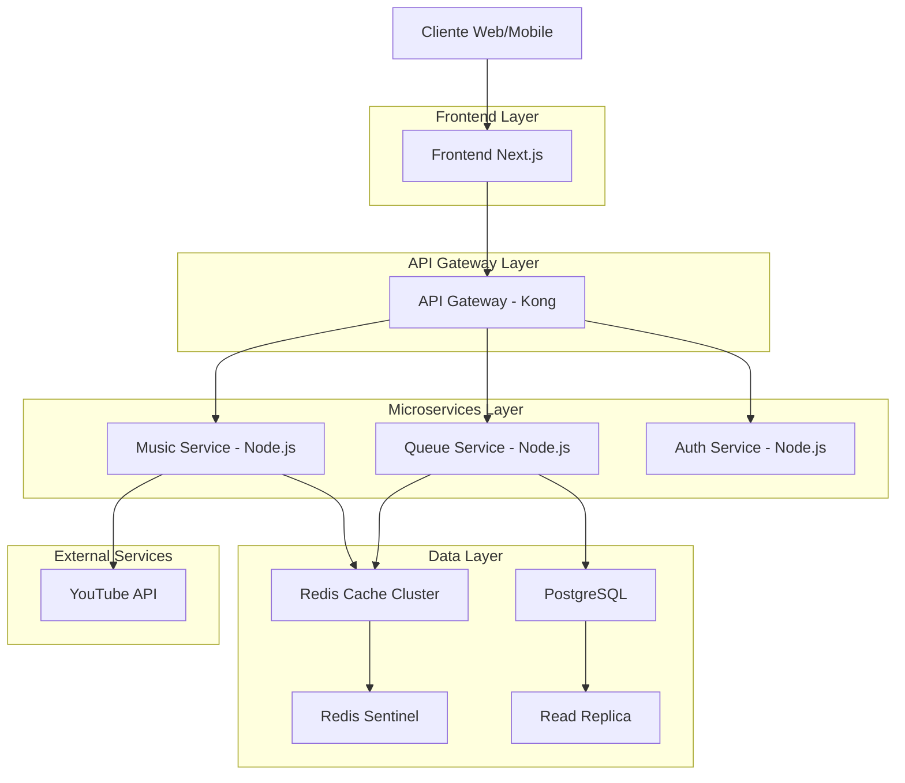
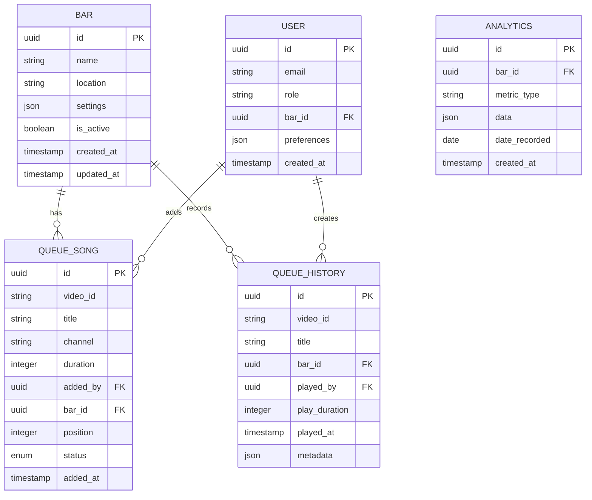
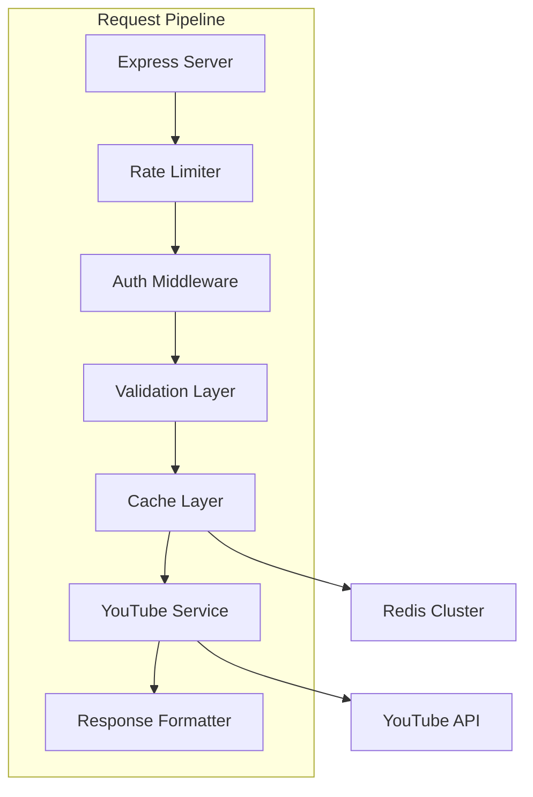
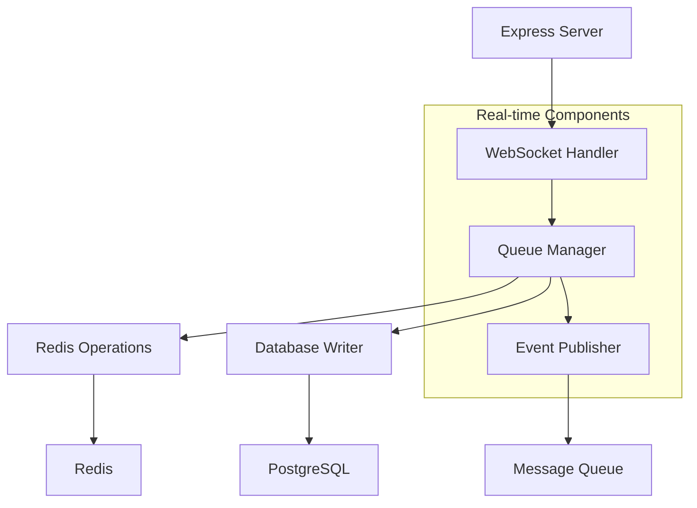

# Arquitectura Técnica: Cola de Reproducción YouTube

## 1. Diseño de Arquitectura



## 2. Stack Tecnológico

### Frontend
- **Framework**: Next.js 14 con React 18
- **UI Library**: Tailwind CSS + shadcn/ui
- **State Management**: Zustand para estado global
- **Video Player**: react-player
- **HTTP Client**: Axios con interceptores
- **WebSocket**: Socket.io-client para actualizaciones en tiempo real

### Backend Services
- **Runtime**: Node.js 20 LTS
- **Framework**: Express.js con TypeScript
- **API Documentation**: OpenAPI 3.0
- **Validation**: Joi y express-validator
- **ORM/Database**: Prisma para PostgreSQL
- **Cache**: Redis con ioredis
- **Message Queue**: Bull para trabajos en segundo plano

### Infraestructura
- **Containerización**: Docker con Docker Compose
- **Orquestación**: Kubernetes (para producción)
- **Load Balancer**: NGINX
- **Monitoreo**: Prometheus + Grafana
- **Logs**: ELK Stack (Elasticsearch, Logstash, Kibana)
- **CI/CD**: GitHub Actions

## 3. Definición de Rutas

### Frontend Routes
| Ruta | Propósito | Componente Principal |
|------|-----------|---------------------|
| `/` | Dashboard del bar | HomePage |
| `/music/search` | Buscador de música | MusicSearchPage |
| `/music/queue` | Cola de reproducción | QueueManagementPage |
| `/music/player` | Reproductor admin | MusicPlayerPage |
| `/analytics` | Estadísticas de música | AnalyticsPage |

### API Routes
| Método | Ruta | Servicio | Descripción |
|--------|------|----------|-------------|
| GET | `/api/music/search` | Music Service | Buscar canciones en YouTube |
| GET | `/api/music/popular` | Music Service | Obtener tendencias por región |
| POST | `/api/music/cache/clear` | Music Service | Limpiar caché de búsqueda |
| GET | `/api/queue` | Queue Service | Obtener cola actual |
| POST | `/api/queue/add` | Queue Service | Añadir canción a la cola |
| POST | `/api/queue/remove` | Queue Service | Eliminar canción de la cola |
| POST | `/api/queue/next` | Queue Service | Saltar a siguiente canción |
| POST | `/api/queue/reorder` | Queue Service | Reordenar cola |
| GET | `/api/queue/history` | Queue Service | Historial de reproducción |
| GET | `/api/analytics/queue` | Analytics Service | Métricas de uso de cola |

## 4. Modelos de Datos

### PostgreSQL Schema


### Redis Data Structures

#### Search Cache
```
Key: search:{query_normalized}
Type: String (JSON)
TTL: 86400 (24 hours)
Value: {
  "results": [...],
  "cached_at": "2024-01-15T10:00:00Z",
  "query_count": 5
}
```

#### Queue per Bar
```
Key: queue:{bar_id}
Type: List (JSON strings)
Value: [
  '{"videoId":"abc123","title":"Song 1","addedBy":"user1"}',
  '{"videoId":"def456","title":"Song 2","addedBy":"user2"}'
]
```

#### Current Song
```
Key: current:{bar_id}
Type: String (JSON)
Value: {
  "videoId": "abc123",
  "startTime": "2024-01-15T10:30:00Z",
  "elapsed": 45,
  "duration": 180
}
```

#### Rate Limiting
```
Key: rate_limit:{endpoint}:{ip}
Type: Hash
Value: {
  "count": 45,
  "reset_at": "2024-01-15T11:00:00Z"
}
```

## 5. API Specifications

### Search Endpoint
```typescript
GET /api/music/search?query={term}&bar_id={id}&limit={n}

Request Headers:
- Authorization: Bearer {jwt_token}
- X-Bar-ID: {bar_id}

Response 200:
{
  "success": true,
  "data": {
    "results": [
      {
        "videoId": "dQw4w9WgXcQ",
        "title": "Rick Astley - Never Gonna Give You Up",
        "channel": "RickAstleyVEVO",
        "duration": "3:32",
        "durationSeconds": 212,
        "thumbnail": {
          "default": "https://i.ytimg.com/vi/dQw4w9WgXcQ/default.jpg",
          "medium": "https://i.ytimg.com/vi/dQw4w9WgXcQ/mqdefault.jpg",
          "high": "https://i.ytimg.com/vi/dQw4w9WgXcQ/hqdefault.jpg"
        },
        "viewCount": "1000000000",
        "publishedAt": "2009-10-24T22:03:31Z"
      }
    ],
    "metadata": {
      "totalResults": 1000000,
      "resultsPerPage": 10,
      "cached": true,
      "cacheHit": true
    }
  }
}

Response 429:
{
  "success": false,
  "error": {
    "code": "RATE_LIMIT_EXCEEDED",
    "message": "Too many requests",
    "retryAfter": 3600
  }
}
```

### Queue Management
```typescript
POST /api/queue/add

Request Body:
{
  "barId": "550e8400-e29b-41d4-a716-446655440000",
  "videoId": "dQw4w9WgXcQ",
  "title": "Rick Astley - Never Gonna Give You Up",
  "channel": "RickAstleyVEVO",
  "duration": 212,
  "thumbnail": "https://i.ytimg.com/vi/dQw4w9WgXcQ/default.jpg"
}

Response 201:
{
  "success": true,
  "data": {
    "queueItem": {
      "id": "660e8400-e29b-41d4-a716-446655440001",
      "position": 5,
      "estimatedStartTime": "2024-01-15T15:45:00Z",
      "addedAt": "2024-01-15T14:30:00Z"
    },
    "queueLength": 6,
    "estimatedWaitTime": 4500 // seconds
  }
}
```

## 6. Servicios Backend

### Music Service Architecture


### Queue Service Architecture


### Implementación de Cache
```typescript
// Cache Service
export class CacheService {
  private redis: Redis;
  
  constructor(redis: Redis) {
    this.redis = redis;
  }
  
  async getSearchResults(query: string): Promise<SearchResult[] | null> {
    const key = `search:${normalizeQuery(query)}`;
    const cached = await this.redis.get(key);
    
    if (cached) {
      const data = JSON.parse(cached);
      // Extender TTL en accesos recientes
      await this.redis.expire(key, 86400);
      return data.results;
    }
    
    return null;
  }
  
  async setSearchResults(query: string, results: SearchResult[]): Promise<void> {
    const key = `search:${normalizeQuery(query)}`;
    const data = {
      results,
      cached_at: new Date().toISOString(),
      query_count: 1
    };
    
    await this.redis.setex(key, 86400, JSON.stringify(data));
  }
  
  async getQueue(barId: string): Promise<QueueItem[]> {
    const key = `queue:${barId}`;
    const items = await this.redis.lrange(key, 0, -1);
    
    return items.map(item => JSON.parse(item));
  }
  
  async addToQueue(barId: string, item: QueueItem): Promise<void> {
    const key = `queue:${barId}`;
    await this.redis.rpush(key, JSON.stringify(item));
    
    // Publicar evento para WebSocket
    await this.redis.publish(`queue_update:${barId}`, JSON.stringify({
      action: 'added',
      item
    }));
  }
}
```

## 7. Frontend Implementation

### Player Component
```typescript
// MusicPlayer.tsx
import ReactPlayer from 'react-player/youtube';
import { useQueueStore } from '@/stores/queueStore';
import { useWebSocket } from '@/hooks/useWebSocket';

export const MusicPlayer: React.FC = () => {
  const { currentSong, queue, isPlaying } = useQueueStore();
  const { socket } = useWebSocket();
  
  useEffect(() => {
    if (socket) {
      socket.on('queue_update', (data) => {
        // Actualizar cola en tiempo real
        useQueueStore.getState().updateQueue(data.queue);
      });
      
      socket.on('song_change', (data) => {
        // Nueva canción actual
        useQueueStore.getState().setCurrentSong(data.song);
      });
    }
    
    return () => {
      socket?.off('queue_update');
      socket?.off('song_change');
    };
  }, [socket]);
  
  const handleSongEnd = async () => {
    try {
      await fetch('/api/queue/next', {
        method: 'POST',
        headers: {
          'Authorization': `Bearer ${getAuthToken()}`,
          'Content-Type': 'application/json'
        },
        body: JSON.stringify({
          barId: getCurrentBarId()
        })
      });
    } catch (error) {
      console.error('Error al pasar a siguiente canción:', error);
    }
  };
  
  if (!currentSong) {
    return (
      <div className="flex items-center justify-center h-64 bg-gray-900 rounded-lg">
        <p className="text-gray-400">No hay canciones en la cola</p>
      </div>
    );
  }
  
  return (
    <div className="relative">
      <ReactPlayer
        url={`https://www.youtube.com/watch?v=${currentSong.videoId}`}
        playing={isPlaying}
        onEnded={handleSongEnd}
        onError={(error) => {
          console.error('Error de reproducción:', error);
          // Intentar siguiente canción automáticamente
          handleSongEnd();
        }}
        width="100%"
        height="400px"
        controls={true}
        config={{
          youtube: {
            playerVars: {
              autoplay: 1,
              modestbranding: 1,
              rel: 0,
              showinfo: 0,
              iv_load_policy: 3
            }
          }
        }}
        className="rounded-lg overflow-hidden"
      />
      
      {/* Overlay con información de la canción */}
      <div className="absolute top-4 left-4 bg-black bg-opacity-70 text-white p-3 rounded-lg">
        <h3 className="font-semibold text-lg">{currentSong.title}</h3>
        <p className="text-sm opacity-80">{currentSong.channel}</p>
        <p className="text-xs opacity-60">
          {queue.length > 0 ? `${queue.length} canciones en cola` : 'Sin cola'}
        </p>
      </div>
    </div>
  );
};
```

### Search Component
```typescript
// MusicSearch.tsx
import { useState, useCallback, useRef } from 'react';
import { useDebounce } from '@/hooks/useDebounce';
import { musicAPI } from '@/services/musicAPI';

export const MusicSearch: React.FC = () => {
  const [query, setQuery] = useState('');
  const [results, setResults] = useState([]);
  const [isLoading, setIsLoading] = useState(false);
  const [error, setError] = useState(null);
  const searchTimeoutRef = useRef<NodeJS.Timeout>();
  
  const debouncedSearch = useDebounce(async (searchQuery: string) => {
    if (!searchQuery.trim() || searchQuery.length < 2) {
      setResults([]);
      return;
    }
    
    setIsLoading(true);
    setError(null);
    
    try {
      const response = await musicAPI.search(searchQuery);
      setResults(response.data.results);
      
      // Mostrar indicador de caché
      if (response.data.metadata.cached) {
        console.log('Resultados desde caché');
      }
    } catch (err) {
      setError(err.message);
      
      if (err.response?.status === 429) {
        setError('Demasiadas búsquedas. Intenta más tarde.');
      }
    } finally {
      setIsLoading(false);
    }
  }, 500);
  
  const handleSearch = useCallback((value: string) => {
    setQuery(value);
    debouncedSearch(value);
  }, [debouncedSearch]);
  
  const addToQueue = async (song: any) => {
    try {
      await musicAPI.addToQueue({
        videoId: song.videoId,
        title: song.title,
        channel: song.channel,
        duration: song.durationSeconds,
        thumbnail: song.thumbnail.default
      });
      
      // Feedback visual
      setResults([]);
      setQuery('');
    } catch (err) {
      console.error('Error al añadir a la cola:', err);
      setError('No se pudo añadir la canción a la cola');
    }
  };
  
  return (
    <div className="max-w-2xl mx-auto p-4">
      <div className="relative">
        <input
          type="text"
          value={query}
          onChange={(e) => handleSearch(e.target.value)}
          placeholder="Buscar canciones, artistas..."
          className="w-full px-4 py-3 pl-10 bg-gray-800 text-white rounded-lg focus:outline-none focus:ring-2 focus:ring-blue-500"
        />
        
        {isLoading && (
          <div className="absolute right-3 top-3">
            <div className="animate-spin rounded-full h-6 w-6 border-b-2 border-blue-500"></div>
          </div>
        )}
      </div>
      
      {error && (
        <div className="mt-4 p-3 bg-red-900 bg-opacity-50 text-red-200 rounded-lg">
          {error}
        </div>
      )}
      
      {results.length > 0 && (
        <div className="mt-4 space-y-2">
          {results.map((song) => (
            <div
              key={song.videoId}
              className="flex items-center p-3 bg-gray-800 rounded-lg hover:bg-gray-700 transition-colors cursor-pointer"
              onClick={() => addToQueue(song)}
            >
              
              
              <div className="ml-3 flex-1 min-w-0">
                <h4 className="text-white font-medium truncate">{song.title}</h4>
                <p className="text-gray-400 text-sm truncate">{song.channel}</p>
                <p className="text-gray-500 text-xs">{song.duration} • {song.viewCount} vistas</p>
              </div>
              
              <button className="ml-4 p-2 text-blue-400 hover:text-blue-300">
                <svg className="w-5 h-5" fill="none" stroke="currentColor" viewBox="0 0 24 24">
                  <path strokeLinecap="round" strokeLinejoin="round" strokeWidth={2} d="M12 4v16m8-8H4" />
                </svg>
              </button>
            </div>
          ))}
        </div>
      )}
    </div>
  );
};
```

## 8. Testing Strategy

### Unit Tests
```typescript
// music.service.test.ts
describe('MusicService', () => {
  let service: MusicService;
  let cacheService: CacheService;
  let youtubeService: YouTubeService;
  
  beforeEach(() => {
    cacheService = new CacheService(mockRedis);
    youtubeService = new YouTubeService(mockYoutubeClient);
    service = new MusicService(cacheService, youtubeService);
  });
  
  describe('search', () => {
    it('should return cached results without calling YouTube API', async () => {
      const mockResults = [{ videoId: 'test123', title: 'Test Song' }];
      cacheService.getSearchResults = jest.fn().mockResolvedValue(mockResults);
      
      const results = await service.search('test query');
      
      expect(results).toEqual(mockResults);
      expect(youtubeService.search).not.toHaveBeenCalled();
    });
    
    it('should call YouTube API when cache miss', async () => {
      const mockResults = [{ videoId: 'test123', title: 'Test Song' }];
      cacheService.getSearchResults = jest.fn().mockResolvedValue(null);
      youtubeService.search = jest.fn().mockResolvedValue(mockResults);
      
      const results = await service.search('test query');
      
      expect(youtubeService.search).toHaveBeenCalledWith('test query');
      expect(cacheService.setSearchResults).toHaveBeenCalledWith('test query', mockResults);
    });
    
    it('should handle quota exceeded error', async () => {
      cacheService.getSearchResults = jest.fn().mockResolvedValue(null);
      youtubeService.search = jest.fn().mockRejectedValue({ code: 403, message: 'quotaExceeded' });
      
      await expect(service.search('test query')).rejects.toThrow(QuotaExceededError);
    });
  });
});
```

### Integration Tests
```typescript
// queue.integration.test.ts
describe('Queue Integration', () => {
  let app: Application;
  let redis: Redis;
  let db: PrismaClient;
  
  beforeAll(async () => {
    app = await createTestApp();
    redis = await createTestRedis();
    db = await createTestDatabase();
  });
  
  afterAll(async () => {
    await app.close();
    await redis.quit();
    await db.$disconnect();
  });
  
  describe('POST /api/queue/add', () => {
    it('should add song to queue and broadcast update', async () => {
      const song = {
        barId: testBar.id,
        videoId: 'test123',
        title: 'Test Song',
        channel: 'Test Artist',
        duration: 180
      };
      
      const response = await request(app)
        .post('/api/queue/add')
        .set('Authorization', `Bearer ${authToken}`)
        .send(song)
        .expect(201);
      
      expect(response.body.success).toBe(true);
      expect(response.body.data.queueItem.position).toBe(0);
      
      // Verificar broadcast WebSocket
      expect(socketEmit).toHaveBeenCalledWith('queue_update', expect.objectContaining({
        action: 'added',
        item: expect.objectContaining({
          videoId: 'test123'
        })
      }));
    });
    
    it('should handle concurrent additions', async () => {
      const songs = Array.from({ length: 10 }, (_, i) => ({
        barId: testBar.id,
        videoId: `song${i}`,
        title: `Song ${i}`,
        channel: `Artist ${i}`,
        duration: 180
      }));
      
      const promises = songs.map(song => 
        request(app)
          .post('/api/queue/add')
          .set('Authorization', `Bearer ${authToken}`)
          .send(song)
      );
      
      const responses = await Promise.all(promises);
      
      // Verificar que todas las canciones se añadieron
      const queueResponse = await request(app)
        .get(`/api/queue?bar_id=${testBar.id}`)
        .set('Authorization', `Bearer ${authToken}`)
        .expect(200);
      
      expect(queueResponse.body.data.queue).toHaveLength(10);
    });
  });
});
```

### E2E Tests
```typescript
// music-player.e2e.test.ts
describe('Music Player E2E', () => {
  let browser: Browser;
  let page: Page;
  
  beforeAll(async () => {
    browser = await playwright.chromium.launch();
    page = await browser.newPage();
  });
  
  afterAll(async () => {
    await browser.close();
  });
  
  test('should search and add song to queue', async () => {
    await page.goto('http://localhost:3000/music/search');
    
    // Buscar canción
    await page.fill('[data-testid="search-input"]', 'Bad Bunny');
    await page.waitForSelector('[data-testid="search-results"]');
    
    // Verificar resultados
    const results = await page.$$('[data-testid="song-item"]');
    expect(results.length).toBeGreaterThan(0);
    
    // Añadir primera canción
    await results[0].click();
    
    // Verificar que se añadió a la cola
    await page.goto('http://localhost:3000/music/queue');
    await page.waitForSelector('[data-testid="queue-list"]');
    
    const queueItems = await page.$$('[data-testid="queue-item"]');
    expect(queueItems.length).toBe(1);
  });
  
  test('should play song automatically when queue starts', async () => {
    await page.goto('http://localhost:3000/music/player');
    
    // Añadir canción a cola vacía
    await addSongToQueue('test-song-1');
    
    // Verificar que comienza reproducción automática
    await page.waitForSelector('[data-testid="player-active"]', { timeout: 5000 });
    
    const playerInfo = await page.textContent('[data-testid="current-song-title"]');
    expect(playerInfo).toContain('Test Song');
  });
  
  test('should handle network disconnection gracefully', async () => {
    await page.goto('http://localhost:3000/music/player');
    
    // Desconectar red
    await page.context().setOffline(true);
    
    // Verificar mensaje de error
    await page.waitForSelector('[data-testid="offline-message"]');
    
    // Reconectar
    await page.context().setOffline(false);
    
    // Verificar recuperación automática
    await page.waitForSelector('[data-testid="player-active"]', { timeout: 10000 });
  });
});
```

## 9. Seguridad

### Rate Limiting
```typescript
// rate-limiter.ts
import { RateLimiterRedis } from 'rate-limiter-flexible';

const rateLimiter = new RateLimiterRedis({
  storeClient: redis,
  keyPrefix: 'music_api_limit',
  points: 100, // Number of requests
  duration: 3600, // Per hour
  blockDuration: 3600, // Block for 1 hour if exceeded
});

export const rateLimitMiddleware = (points: number = 100) => {
  return async (req: Request, res: Response, next: NextFunction) => {
    try {
      await rateLimiter.consume(req.ip, points);
      next();
    } catch (rejRes) {
      res.status(429).json({
        success: false,
        error: {
          code: 'RATE_LIMIT_EXCEEDED',
          message: 'Too many requests',
          retryAfter: rejRes.msBeforeNext
        }
      });
    }
  };
};
```

### Input Validation
```typescript
// validation.ts
import Joi from 'joi';

export const searchValidation = Joi.object({
  query: Joi.string()
    .min(2)
    .max(100)
    .pattern(/^[a-zA-Z0-9\s\-\'\u00C0-\u017F]+$/)
    .required()
    .messages({
      'string.min': 'La búsqueda debe tener al menos 2 caracteres',
      'string.max': 'La búsqueda no puede exceder 100 caracteres',
      'string.pattern.base': 'Caracteres inválidos en la búsqueda'
    }),
  bar_id: Joi.string().uuid().required(),
  limit: Joi.number().integer().min(1).max(50).default(10)
});

export const queueAddValidation = Joi.object({
  barId: Joi.string().uuid().required(),
  videoId: Joi.string()
    .pattern(/^[a-zA-Z0-9\-_]{11}$/)
    .required()
    .messages({
      'string.pattern.base': 'ID de video de YouTube inválido'
    }),
  title: Joi.string().min(1).max(200).required(),
  channel: Joi.string().min(1).max(100).required(),
  duration: Joi.number().integer().min(1).max(3600).required(),
  thumbnail: Joi.string().uri().optional()
});
```

### CORS Configuration
```typescript
// cors.ts
import cors from 'cors';

const corsOptions: cors.CorsOptions = {
  origin: (origin, callback) => {
    const allowedOrigins = [
      'http://localhost:3000',
      'https://encore.app',
      'https://admin.encore.app'
    ];
    
    if (!origin || allowedOrigins.includes(origin)) {
      callback(null, true);
    } else {
      callback(new Error('Not allowed by CORS'));
    }
  },
  credentials: true,
  methods: ['GET', 'POST', 'PUT', 'DELETE', 'OPTIONS'],
  allowedHeaders: [
    'Origin',
    'X-Requested-With',
    'Content-Type',
    'Accept',
    'Authorization',
    'X-Bar-ID'
  ],
  maxAge: 86400 // 24 hours
};

export const corsMiddleware = cors(corsOptions);
```

## 10. Monitoreo y Observabilidad

### Metrics Collection
```typescript
// metrics.ts
import prometheus from 'prom-client';

export const httpRequestDuration = new prometheus.Histogram({
  name: 'http_request_duration_seconds',
  help: 'Duration of HTTP requests in seconds',
  labelNames: ['method', 'route', 'status_code'],
  buckets: [0.1, 0.5, 1, 2, 5]
});

export const youtubeQuotaUsage = new prometheus.Counter({
  name: 'youtube_quota_usage_total',
  help: 'Total YouTube API quota usage',
  labelNames: ['endpoint', 'cache_hit']
});

export const queueOperations = new prometheus.Counter({
  name: 'queue_operations_total',
  help: 'Total queue operations',
  labelNames: ['operation', 'bar_id', 'status']
});

export const activeConnections = new prometheus.Gauge({
  name: 'websocket_connections_active',
  help: 'Number of active WebSocket connections',
  labelNames: ['bar_id']
});
```

### Health Checks
```typescript
// health.ts
export const healthCheck = async (req: Request, res: Response) => {
  const health = {
    status: 'healthy',
    timestamp: new Date().toISOString(),
    services: {
      redis: await checkRedisHealth(),
      database: await checkDatabaseHealth(),
      youtube: await checkYouTubeAPIHealth()
    }
  };
  
  const isHealthy = Object.values(health.services).every(service => service.status === 'healthy');
  
  res.status(isHealthy ? 200 : 503).json(health);
};

async function checkRedisHealth(): Promise<ServiceHealth> {
  try {
    await redis.ping();
    return { status: 'healthy', latency: await getRedisLatency() };
  } catch (error) {
    return { status: 'unhealthy', error: error.message };
  }
}

async function checkYouTubeAPIHealth(): Promise<ServiceHealth> {
  try {
    const start = Date.now();
    await youtube.search.list({ q: 'test', maxResults: 1 });
    const latency = Date.now() - start;
    
    return { status: 'healthy', latency };
  } catch (error) {
    return { status: 'unhealthy', error: error.message };
  }
}
```

### Alerting Rules
```yaml
# prometheus-alerts.yml
groups:
  - name: music-service
    rules:
      - alert: HighYouTubeQuotaUsage
        expr: youtube_quota_usage_total > 8000
        for: 5m
        labels:
          severity: warning
        annotations:
          summary: "High YouTube API quota usage"
          description: "YouTube API quota usage is {{ $value }} units"
      
      - alert: RedisConnectionFailed
        expr: redis_up == 0
        for: 1m
        labels:
          severity: critical
        annotations:
          summary: "Redis connection failed"
          description: "Redis server is not responding"
      
      - alert: HighQueueLatency
        expr: histogram_quantile(0.95, rate(queue_operation_duration_seconds_bucket[5m])) > 1
        for: 5m
        labels:
          severity: warning
        annotations:
          summary: "High queue operation latency"
          description: "95th percentile latency is {{ $value }}s"
```

## 11. Deployment

### Docker Configuration
```dockerfile
# Dockerfile.music-service
FROM node:20-alpine AS builder

WORKDIR /app
COPY package*.json ./
RUN npm ci --only=production

FROM node:20-alpine

RUN apk add --no-cache redis

WORKDIR /app
COPY --from=builder /app/node_modules ./node_modules
COPY . .

EXPOSE 3001

HEALTHCHECK --interval=30s --timeout=3s --start-period=5s --retries=3 \
  CMD node healthcheck.js

USER node
CMD ["npm", "start"]
```

### Kubernetes Deployment
```yaml
# music-service-deployment.yaml
apiVersion: apps/v1
kind: Deployment
metadata:
  name: music-service
  labels:
    app: music-service
spec:
  replicas: 3
  selector:
    matchLabels:
      app: music-service
  template:
    metadata:
      labels:
        app: music-service
    spec:
      containers:
      - name: music-service
        image: encore/music-service:latest
        ports:
        - containerPort: 3001
        env:
        - name: REDIS_URL
          valueFrom:
            secretKeyRef:
              name: redis-secret
              key: url
        - name: YOUTUBE_API_KEY
          valueFrom:
            secretKeyRef:
              name: youtube-api-secret
              key: api-key
        resources:
          requests:
            memory: "256Mi"
            cpu: "250m"
          limits:
            memory: "512Mi"
            cpu: "500m"
        livenessProbe:
          httpGet:
            path: /health
            port: 3001
          initialDelaySeconds: 30
          periodSeconds: 10
        readinessProbe:
          httpGet:
            path: /health
            port: 3001
          initialDelaySeconds: 5
          periodSeconds: 5
```

### Environment Configuration
```bash
# .env.production
NODE_ENV=production
PORT=3001

# Redis Configuration
REDIS_URL=redis://redis-cluster:6379
REDIS_CLUSTER_ENABLED=true
REDIS_SENTINELS=redis-sentinel-1:26379,redis-sentinel-2:26379,redis-sentinel-3:26379

# YouTube API
YOUTUBE_API_KEY=${YOUTUBE_API_KEY}
YOUTUBE_QUOTA_LIMIT=10000
YOUTUBE_CACHE_TTL=86400

# Database
DATABASE_URL=${DATABASE_URL}
DATABASE_POOL_SIZE=20

# Rate Limiting
RATE_LIMIT_WINDOW_MS=3600000
RATE_LIMIT_MAX_REQUESTS=100

# Monitoring
PROMETHEUS_ENABLED=true
JAEGER_ENABLED=true
LOG_LEVEL=info
```

Esta arquitectura técnica proporciona una base sólida para implementar la funcionalidad de cola de reproducción con YouTube API, abordando todos los aspectos críticos desde la optimización de cuota hasta la sincronización en tiempo real y la escalabilidad.