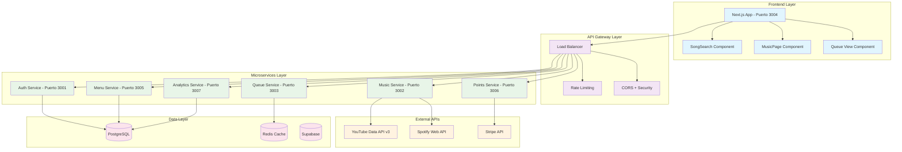

# Arquitectura Técnica - Encore Music Platform

## 🎯 Visión General

Encore es una plataforma de rockola digital para bares y restaurantes que permite a los clientes buscar, seleccionar y gestionar música mediante una experiencia interactiva gamificada con sistema de puntos.

---

## 🏗️ Arquitectura de Microservicios

### **¿Por qué Microservicios?**

**Decisión Arquitectónica:** Elegimos microservicios sobre monolítico por:

1. **🎵 Especialización por Dominio:** Cada servicio maneja una responsabilidad específica
2. **📈 Escalabilidad Independiente:** Music Service puede escalar por separado de Queue Service
3. **🔧 Mantenimiento Simplificado:** Actualizar YouTube API no afecta al sistema de puntos
4. **🚀 Despliegue Granular:** Podemos actualizar solo el componente necesario
5. **🛡️ Aislamiento de Fallos:** Si Queue Service falla, Music Service sigue funcionando

---

## 📊 Diagrama de Arquitectura



---

## 🔧 Detalle de Microservicios

### **1. Music Service (Puerto 3002)**

**Responsabilidad:** Búsqueda y metadata de música

**¿Por qué Express.js + YouTube API?**
- **Express.js:** Ligero, flexible, middleware ecosystem
- **YouTube Data API v3:** Catálogo más grande de música del mundo
- **Redis Cache:** Evitar límites de quota y mejorar rendimiento

**Stack Tecnológico:**
```javascript
- Node.js 20+ (Performance y ecosistema npm)
- Express.js 4.18.2 (Framework estable y robusto)
- Redis 7.x (Cache y rate limiting)
- Axios (HTTP client robusto)
- TypeScript (Type safety)
```

**Decisiones Clave:**
- **Cache en Redis:** Reducir llamadas a YouTube API (quota limit 10,000/day)
- **Endpoints simples:** `/search`, `/video/:id`, `/trending`
- **Error handling:** Graceful degradation si YouTube falla

---

### **2. Queue Service (Puerto 3003)**

**Responsabilidad:** Gestión de cola de reproducción y puntos

**¿Por qué Redis + Node.js?**
- **Redis:** Estructuras de datos perfectas para colas (LPUSH/RPOP)
- **Transacciones atómicas:** MULTI/EXEC para consistencia
- **Sets para deduplicación:** Evitar canciones duplicadas
- **Performance:** Operaciones O(1) para alta concurrencia

**Stack Tecnológico:**
```javascript
- Node.js + Express.js (API REST)
- Redis 7.x (Colas y cache)
- ioredis (Redis client con clustering)
- JWT (Autenticación entre servicios)
```

**Decisiones Clave:**
- **Colas separadas:** `priority` vs `standard` para canciones prioritarias
- **Redis Sets:** `queue:{barId}:set` para deduplicación O(1)
- **TTL automático:** Limpieza de colas inactivas
- **Transacciones atómicas:** MULTI/EXEC para consistencia

---

### **3. Frontend (Puerto 3004)**

**Responsabilidad:** Experiencia de usuario y UI

**¿Por qué Next.js + React?**
- **Next.js 15:** App Router, Server Components, SEO
- **React 19:** Concurrent features, hooks modernos
- **Tailwind CSS:** Diseño responsive sin escribir CSS
- **TypeScript:** Type safety en todo el stack

**Stack Tecnológico:**
```javascript
- Next.js 15.5.2 (Framework full-stack)
- React 19.1.0 (UI library)
- TypeScript 5.x (Type safety)
- Tailwind CSS 4 (Styling)
- Zustand (State management)
- Axios (API client)
```

**Decisiones Clave:**
- **Client Components:** Para interactividad (búsqueda, cola)
- **API Client centralizado:** `musicService.ts`
- **Component separation:** `SongSearch`, `MusicPage`, `QueueView`
- **Error boundaries:** Graceful degradation

---

## 🔄 Flujo de Comunicación

### **1. Búsqueda de Canciones**
```
Frontend → Music Service → YouTube API → Redis Cache → Frontend
```

1. Usuario escribe "queen" en frontend
2. Frontend llama a `GET /api/youtube/search?q=queen`
3. Music Service verifica cache Redis
4. Si no hay cache, llama a YouTube Data API
5. Guarda resultado en Redis (TTL: 30 min)
6. Retorna metadata al frontend

### **2. Añadir a la Cola**
```
Frontend → Queue Service → Redis (Cola + Set) → Points Service → Frontend
```

1. Usuario hace clic en "Añadir" canción
2. Frontend valida puntos disponibles
3. Llama a `POST /api/queue/add` con metadata
4. Queue Service verifica duplicados con Redis SET
5. Si no hay duplicado, añade a Redis LIST
6. Llama a Points Service para deducir puntos
7. Retorna confirmación al frontend

### **3. Vista de Cola en Tiempo Real**
```
Frontend → Queue Service → Redis (LPUSH/RPOP) → Frontend (polling)
```

1. Frontend solicita `GET /api/queue/{barId}` cada 30s
2. Queue Service combina colas priority + standard
3. Retorna lista ordenada al frontend
4. Frontend actualiza UI con nuevas posiciones

---

## 🛡️ Seguridad y Performance

### **Seguridad**
- **JWT entre servicios:** Autenticación interna
- **Rate limiting:** 100 requests/minuto por usuario
- **Input validation:** TypeScript + validación manual
- **CORS restrictivo:** Solo orígenes permitidos
- **Helmet.js:** Security headers por defecto

### **Performance**
- **Redis cache:** Reducción 90% llamadas YouTube API
- **Connection pooling:** ioredis clustering
- **Compression:** gzip en todas las respuestas
- **CDN ready:** Assets estáticos optimizados
- **Lazy loading:** Componentes bajo demanda

---

## 📈 Escalabilidad

### **Escalabilidad Horizontal**
- **Music Service:** Multiple instancias behind load balancer
- **Queue Service:** Redis clustering para alta disponibilidad
- **Frontend:** Next.js edge functions global

### **Escalabilidad Vertical**
- **Redis:** Aumentar memoria para más colas activas
- **PostgreSQL:** Read replicas para analytics
- **YouTube API:** Implementar cache distribuido

---

## 🔮 Decisiones Futuras

### **Corto Plazo (1-3 meses)**
- **WebSocket:** Actualizaciones en tiempo real sin polling
- **Spotify Integration:** Segundo proveedor de música
- **Admin Dashboard:** Panel de control para bar owners

### **Mediano Plazo (3-6 meses)**
- **Machine Learning:** Recomendaciones personalizadas
- **Mobile App:** React Native para iOS/Android
- **Multi-tenant:** Soporte para múltiples bares

### **Largo Plazo (6+ meses)**
- **Micro Frontends:** Modularización del frontend
- **Event Sourcing:** Reconstrucción de estado de colas
- **GraphQL:** API Gateway unificado

---

## 🚀 Despliegue

### **Development**
```bash
# Local development con Docker Compose
docker-compose up -d postgres redis
npm run dev:backend  # Todos los microservicios
npm run dev:frontend # Next.js development server
```

### **Production**
```bash
# Kubernetes deployment
kubectl apply -f k8s/music-service.yaml
kubectl apply -f k8s/queue-service.yaml
kubectl apply -f k8s/frontend.yaml
```

---

## 📊 Métricas y Monitoreo

### **KPIs Clave**
- **Latencia búsqueda:** < 500ms (con cache)
- **Throughput cola:** 1000+ operaciones/segundo
- **Disponibilidad:** 99.9% uptime
- **Concurrencia:** 500+ usuarios simultáneos

### **Monitoring Stack**
- **Prometheus:** Métricas de aplicación
- **Grafana:** Dashboards en tiempo real
- **ELK Stack:** Logs centralizados
- **Jaeger:** Distributed tracing

---

## 🎯 Conclusión

La arquitectura de Encore está diseñada para **escalabilidad, mantenibilidad y experiencia de usuario excepcional**. Cada microservicio tiene una responsabilidad clara, las tecnologías se eligieron por su madurez y performance, y el sistema está preparado para crecer desde un bar hasta miles de establecimientos.

**Principios guía:**
- **Simplicidad sobre complejidad**
- **Performance sobre optimización prematura**
- **Experiencia de usuario sobre tecnología**
- **Escalabilidad sobre funcionalidad inmediata
