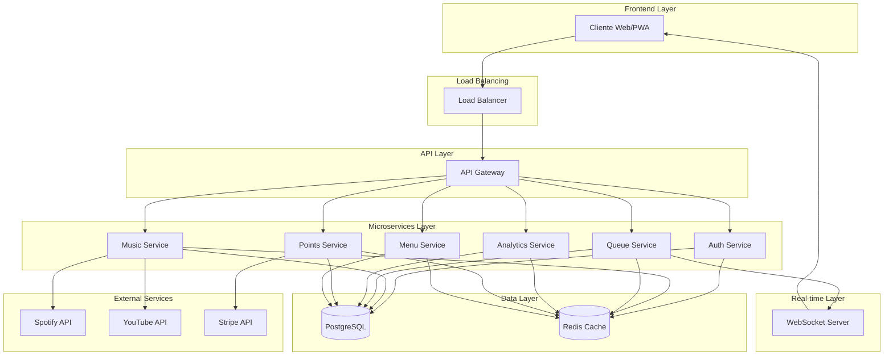
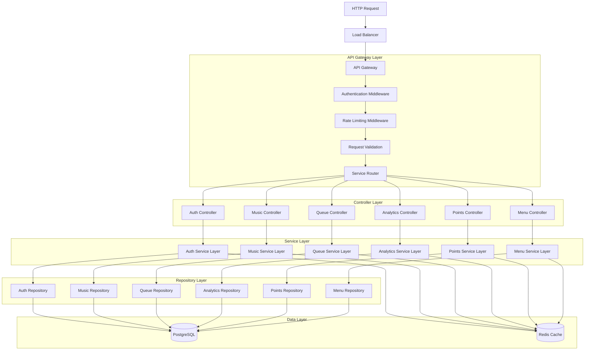
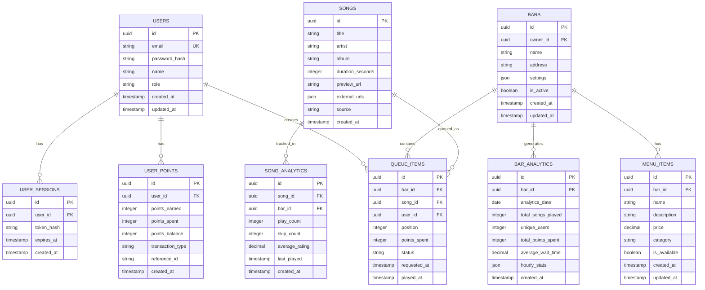

# Arquitectura Técnica - Proyecto Encore

## 1. Diseño de Arquitectura



## 2. Descripción de Tecnologías

- **Frontend:** Next.js 14 + React 18 + TypeScript + Tailwind CSS + PWA
- **Backend:** Node.js + Express.js + TypeScript
- **Base de Datos:** PostgreSQL 15 con connection pooling
- **Cache:** Redis 7.x
- **WebSockets:** Socket.IO
- **Contenedores:** Docker + Docker Compose
- **Autenticación:** JWT + bcrypt + Sistema de Roles Unificado
- **APIs Externas:** Spotify Web API, YouTube Data API, Stripe
- **Gestión de Roles:** Constantes TypeScript `UserRole` enum
- **Middleware:** Autorización basada en roles con validación tipada

## 3. Definiciones de Rutas

### 3.1 Frontend Routes

| Ruta | Propósito |
|------|----------|
| / | Página principal con selección de modo (cliente/admin) |
| /client | Interfaz de cliente para seleccionar música |
| /client/queue | Vista de cola de reproducción en tiempo real |
| /admin | Panel de administración del bar |
| /admin/dashboard | Dashboard con métricas y controles |
| /admin/menu | Gestión de menú del bar |
| /admin/analytics | Reportes y análisis de uso |
| /qr | Generador de códigos QR para acceso rápido |
| /offline | Página de modo offline para PWA |

### 3.2 API Gateway Routes

| Ruta | Servicio | Propósito |
|------|----------|----------|
| /api/auth/* | auth-service | Autenticación y autorización |
| /api/music/* | music-service | Gestión de música y búsqueda |
| /api/queue/* | queue-service | Cola de reproducción |
| /api/analytics/* | analytics-service | Métricas y reportes |
| /api/points/* | points-service | Sistema de puntos |
| /api/menu/* | menu-service | Gestión de menús |

## 4. Sistema de Roles Unificado

### 4.1 Definición de Roles

```typescript
enum UserRole {
  GUEST = 'guest',
  MEMBER = 'member', 
  BAR_OWNER = 'bar_owner',
  SUPER_ADMIN = 'super_admin'
}
```

### 4.2 Implementación en Código

#### Controladores de Autenticación
- **Archivo:** `authController.ts`
- **Cambios:** Eliminación de cadenas literales, uso exclusivo de `UserRole` constantes
- **Funciones afectadas:** `registerMember`, `registerBarOwner`, validaciones de rol

#### Middleware de Autorización
- **Archivo:** `middleware/auth.ts`
- **Funciones:** `requireRole`, `requireAnyRole`, `requireOwnershipOrRole`
- **Implementación:** Validación tipada con constantes `UserRole`

#### Rutas de Usuario
- **Archivo:** `src/routes/users.ts`
- **Cambios:** Reemplazo de `'admin'` por `UserRole.SUPER_ADMIN`
- **Beneficio:** Consistencia en toda la aplicación

### 4.3 Configuración de Permisos

| Rol | Acceso a Rutas | Permisos Especiales |
|-----|----------------|--------------------|
| `GUEST` | Públicas, información básica | Solo lectura |
| `MEMBER` | Interacción con música, puntos | Agregar a cola, gastar puntos |
| `BAR_OWNER` | Gestión de bar, analytics | Control total del establecimiento |
| `SUPER_ADMIN` | Todas las rutas | Gestión global del sistema |

### 4.4 Integración con Servicios

```typescript
// Ejemplo de uso en servicios
import { UserRole } from '../types/UserRole';

// En lugar de: requireRole('admin')
requireRole(UserRole.SUPER_ADMIN);

// En lugar de: user.role === 'bar_owner'
user.role === UserRole.BAR_OWNER;
```

## 5. Definiciones de API

### 5.1 Auth Service API

**Registro de usuario**
```
POST /api/auth/register
```

Request:
| Parámetro | Tipo | Requerido | Descripción |
|-----------|------|-----------|-------------|
| email | string | true | Email del usuario |
| password | string | true | Contraseña (mínimo 8 caracteres) |
| name | string | true | Nombre completo |
| role | string | false | Rol del usuario (customer/bar_owner) |

Response:
| Parámetro | Tipo | Descripción |
|-----------|------|-------------|
| success | boolean | Estado de la operación |
| token | string | JWT token |
| user | object | Datos del usuario |

**Login de usuario**
```
POST /api/auth/login
```

Request:
| Parámetro | Tipo | Requerido | Descripción |
|-----------|------|-----------|-------------|
| email | string | true | Email del usuario |
| password | string | true | Contraseña |

Response:
| Parámetro | Tipo | Descripción |
|-----------|------|-------------|
| success | boolean | Estado de la operación |
| token | string | JWT token |
| user | object | Datos del usuario |

### 4.2 Music Service API

**Búsqueda de canciones**
```
GET /api/music/search
```

Query Parameters:
| Parámetro | Tipo | Requerido | Descripción |
|-----------|------|-----------|-------------|
| q | string | true | Término de búsqueda |
| limit | number | false | Límite de resultados (default: 20) |
| source | string | false | Fuente (spotify/youtube/local) |

Response:
| Parámetro | Tipo | Descripción |
|-----------|------|-------------|
| songs | array | Lista de canciones encontradas |
| total | number | Total de resultados |
| source | string | Fuente de los resultados |

**Obtener detalles de canción**
```
GET /api/music/songs/:id
```

Response:
| Parámetro | Tipo | Descripción |
|-----------|------|-------------|
| id | string | ID único de la canción |
| title | string | Título de la canción |
| artist | string | Artista |
| album | string | Álbum |
| duration | number | Duración en segundos |
| preview_url | string | URL de preview |
| external_urls | object | URLs externas (Spotify, YouTube) |

### 4.3 Queue Service API

**Agregar canción a la cola**
```
POST /api/queue/add
```

Request:
| Parámetro | Tipo | Requerido | Descripción |
|-----------|------|-----------|-------------|
| song_id | string | true | ID de la canción |
| bar_id | string | true | ID del bar |
| user_id | string | true | ID del usuario |
| points_spent | number | false | Puntos gastados para prioridad |

Response:
| Parámetro | Tipo | Descripción |
|-----------|------|-------------|
| success | boolean | Estado de la operación |
| position | number | Posición en la cola |
| estimated_wait | number | Tiempo estimado de espera (minutos) |

**Obtener estado de la cola**
```
GET /api/queue/:bar_id
```

Response:
| Parámetro | Tipo | Descripción |
|-----------|------|-------------|
| current_song | object | Canción actual reproduciéndose |
| queue | array | Lista de canciones en cola |
| total_songs | number | Total de canciones en cola |
| estimated_duration | number | Duración total estimada |

### 4.4 Points Service API

**Obtener puntos del usuario**
```
GET /api/points/user/:user_id
```

Response:
| Parámetro | Tipo | Descripción |
|-----------|------|-------------|
| total_points | number | Puntos totales del usuario |
| available_points | number | Puntos disponibles para gastar |
| level | number | Nivel actual del usuario |
| next_level_points | number | Puntos necesarios para siguiente nivel |

**Gastar puntos**
```
POST /api/points/spend
```

Request:
| Parámetro | Tipo | Requerido | Descripción |
|-----------|------|-----------|-------------|
| user_id | string | true | ID del usuario |
| points | number | true | Cantidad de puntos a gastar |
| reason | string | true | Motivo del gasto |
| reference_id | string | false | ID de referencia (ej: queue_item_id) |

## 5. Arquitectura del Servidor



## 6. Modelo de Datos

### 6.1 Diagrama de Entidad-Relación



### 6.2 Definiciones de Lenguaje de Definición de Datos (DDL)

**Tabla de Usuarios**
```sql
-- Crear tabla de usuarios
CREATE TABLE users (
    id UUID PRIMARY KEY DEFAULT gen_random_uuid(),
    email VARCHAR(255) UNIQUE NOT NULL,
    password_hash VARCHAR(255) NOT NULL,
    name VARCHAR(100) NOT NULL,
    role VARCHAR(20) DEFAULT 'customer' CHECK (role IN ('customer', 'bar_owner', 'admin')),
    created_at TIMESTAMP WITH TIME ZONE DEFAULT NOW(),
    updated_at TIMESTAMP WITH TIME ZONE DEFAULT NOW()
);

-- Índices
CREATE INDEX idx_users_email ON users(email);
CREATE INDEX idx_users_role ON users(role);

-- Datos iniciales
INSERT INTO users (email, password_hash, name, role) VALUES
('admin@encore.com', '$2b$10$example_hash', 'Admin User', 'admin'),
('bar@example.com', '$2b$10$example_hash', 'Bar Owner', 'bar_owner');
```

**Tabla de Bares**
```sql
-- Crear tabla de bares
CREATE TABLE bars (
    id UUID PRIMARY KEY DEFAULT gen_random_uuid(),
    owner_id UUID NOT NULL REFERENCES users(id) ON DELETE CASCADE,
    name VARCHAR(100) NOT NULL,
    address TEXT,
    settings JSONB DEFAULT '{}',
    is_active BOOLEAN DEFAULT true,
    created_at TIMESTAMP WITH TIME ZONE DEFAULT NOW(),
    updated_at TIMESTAMP WITH TIME ZONE DEFAULT NOW()
);

-- Índices
CREATE INDEX idx_bars_owner_id ON bars(owner_id);
CREATE INDEX idx_bars_is_active ON bars(is_active);
CREATE INDEX idx_bars_settings ON bars USING GIN(settings);

-- Datos iniciales
INSERT INTO bars (owner_id, name, address, settings) 
SELECT id, 'Demo Bar', '123 Music Street', '{"max_queue_size": 50, "points_per_song": 10}'
FROM users WHERE role = 'bar_owner' LIMIT 1;
```

**Tabla de Canciones**
```sql
-- Crear tabla de canciones
CREATE TABLE songs (
    id UUID PRIMARY KEY DEFAULT gen_random_uuid(),
    title VARCHAR(255) NOT NULL,
    artist VARCHAR(255) NOT NULL,
    album VARCHAR(255),
    duration_seconds INTEGER NOT NULL,
    preview_url TEXT,
    external_urls JSONB DEFAULT '{}',
    source VARCHAR(20) DEFAULT 'local' CHECK (source IN ('local', 'spotify', 'youtube')),
    created_at TIMESTAMP WITH TIME ZONE DEFAULT NOW()
);

-- Índices
CREATE INDEX idx_songs_title ON songs(title);
CREATE INDEX idx_songs_artist ON songs(artist);
CREATE INDEX idx_songs_source ON songs(source);
CREATE INDEX idx_songs_external_urls ON songs USING GIN(external_urls);

-- Índice de texto completo para búsqueda
CREATE INDEX idx_songs_search ON songs USING GIN(to_tsvector('spanish', title || ' ' || artist || ' ' || COALESCE(album, '')));
```

**Tabla de Cola de Reproducción**
```sql
-- Crear tabla de cola de reproducción
CREATE TABLE queue_items (
    id UUID PRIMARY KEY DEFAULT gen_random_uuid(),
    bar_id UUID NOT NULL REFERENCES bars(id) ON DELETE CASCADE,
    song_id UUID NOT NULL REFERENCES songs(id) ON DELETE CASCADE,
    user_id UUID NOT NULL REFERENCES users(id) ON DELETE CASCADE,
    position INTEGER NOT NULL,
    points_spent INTEGER DEFAULT 0,
    status VARCHAR(20) DEFAULT 'pending' CHECK (status IN ('pending', 'playing', 'played', 'skipped')),
    requested_at TIMESTAMP WITH TIME ZONE DEFAULT NOW(),
    played_at TIMESTAMP WITH TIME ZONE
);

-- Índices
CREATE INDEX idx_queue_items_bar_id ON queue_items(bar_id);
CREATE INDEX idx_queue_items_status ON queue_items(status);
CREATE INDEX idx_queue_items_position ON queue_items(bar_id, position);
CREATE INDEX idx_queue_items_requested_at ON queue_items(requested_at DESC);

-- Constraint único para posición por bar
CREATE UNIQUE INDEX idx_queue_items_bar_position ON queue_items(bar_id, position) WHERE status = 'pending';
```

**Tabla de Puntos de Usuario**
```sql
-- Crear tabla de puntos de usuario
CREATE TABLE user_points (
    id UUID PRIMARY KEY DEFAULT gen_random_uuid(),
    user_id UUID NOT NULL REFERENCES users(id) ON DELETE CASCADE,
    points_earned INTEGER DEFAULT 0,
    points_spent INTEGER DEFAULT 0,
    points_balance INTEGER NOT NULL,
    transaction_type VARCHAR(50) NOT NULL,
    reference_id UUID,
    created_at TIMESTAMP WITH TIME ZONE DEFAULT NOW()
);

-- Índices
CREATE INDEX idx_user_points_user_id ON user_points(user_id);
CREATE INDEX idx_user_points_created_at ON user_points(created_at DESC);
CREATE INDEX idx_user_points_transaction_type ON user_points(transaction_type);

-- Vista para balance actual de puntos por usuario
CREATE VIEW user_points_balance AS
SELECT 
    user_id,
    SUM(points_earned) as total_earned,
    SUM(points_spent) as total_spent,
    SUM(points_earned) - SUM(points_spent) as current_balance
FROM user_points
GROUP BY user_id;
```

**Configuración de Permisos Supabase**
```sql
-- Permisos básicos para rol anónimo
GRANT SELECT ON songs TO anon;
GRANT SELECT ON bars TO anon;

-- Permisos completos para usuarios autenticados
GRANT ALL PRIVILEGES ON users TO authenticated;
GRANT ALL PRIVILEGES ON bars TO authenticated;
GRANT ALL PRIVILEGES ON songs TO authenticated;
GRANT ALL PRIVILEGES ON queue_items TO authenticated;
GRANT ALL PRIVILEGES ON user_points TO authenticated;
GRANT ALL PRIVILEGES ON menu_items TO authenticated;
GRANT ALL PRIVILEGES ON bar_analytics TO authenticated;
GRANT ALL PRIVILEGES ON song_analytics TO authenticated;
GRANT ALL PRIVILEGES ON user_sessions TO authenticated;

-- Permisos en vistas
GRANT SELECT ON user_points_balance TO authenticated;
```