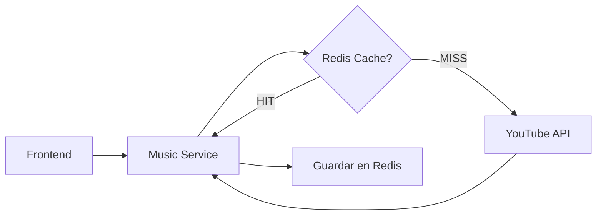
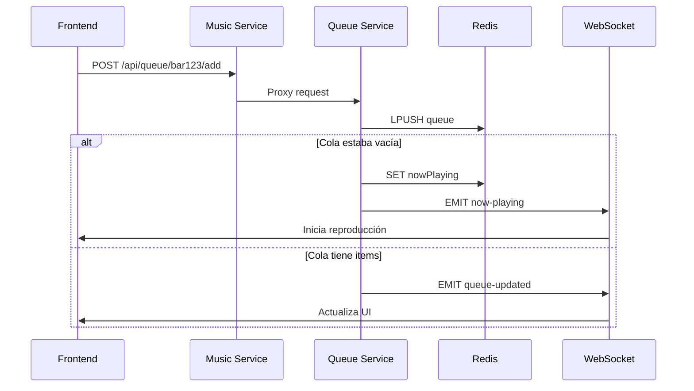
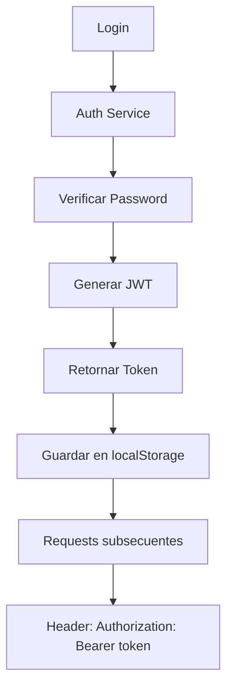

---
tags:
  - servicios
  - backend
  - puertos
last_updated: 2026-02-09
---

# Mapa de Microservicios

Tabla de referencia de los servicios backend y sus puntos de entrada.

## Servicios Implementados

| Servicio | Puerto | Status | Responsabilidad Principal | Tecnologías Clave |
| :--- | :--- | :--- | :--- | :--- |
| **[[Auth-Service]]** | `3001` | ✅ Implementado | Autenticación, gestión de usuarios, JWT | JWT, Bcrypt |
| **[[Music-Service]]** | `3002` | ✅ Implementado | Búsqueda de canciones, metadata, caché | YouTube API, [[Redis]] |
| **[[Queue-Service]]** | `3003` | ✅ Implementado | Cola de reproducción, "Now Playing", auto-start | Socket.IO, [[Redis]] |
| **[[Points-Service]]** | `3006` | 🔜 En desarrollo | Gestión de saldo, compras de créditos | Stripe / Mercado Pago |
| **[[Menu-Service]]** | `3005` | 🔜 Planeado | Catálogo de productos, assets 3D | [[PostgreSQL]], model-viewer |
| **[[Analytics-Service]]** | `3007` | 🔜 Planeado | Métricas de uso, canciones más pedidas | Agregación de datos |

## Frontend

| Aplicación | Puerto | Descripción |
|------------|--------|-------------|
| **Next.js App** | `3004` | Aplicación principal (cliente + admin) |

---

## Flujo de Datos Críticos

### 1. Búsqueda de Música



1. Frontend → `Music Service` (Check Redis → YouTube API si no hay caché)
2. Caché guarda resultados durante 10 días
3. Respuesta instantánea en subsecuentes búsquedas

### 2. Agregar a Cola + Auto-Start



1. Frontend → `Music Service` → `Queue Service` (Push to Redis List)
2. **Si cola vacía**: Auto-start de canción + Emit WebSocket `now-playing`
3. **Si cola no vacía**: Solo emit WebSocket `queue-updated`

### 3. Autenticación



1. Usuario → `Auth Service` (login)
2. Auth Service valida credentials y genera JWT
3. Frontend guarda token en localStorage
4. Todas las requests subsecuentes incluyen token en headers

---

## Comunicación Entre Servicios

### Music Service como Proxy

`Music Service` actúa como punto de entrada unificado para el frontend:

```typescript
// Frontend: Solo conoce Music Service
POST http://localhost:3002/api/queue/bar123/add

// Music Service: Proxy a Queue Service
POST http://localhost:3003/api/queue/add
```

**Ventaja**: Frontend no necesita conocer múltiples URLs.

### WebSocket Rooms

Queue Service usa rooms de Socket.IO para aislar eventos por bar:

```typescript
// Cliente se une a room
socket.join('bar:bar123');

// Emitir solo a ese bar
io.to('bar:bar123').emit('now-playing', songData);
```

---

## Variables de Entorno por Servicio

| Servicio | Variables Críticas |
|----------|-------------------|
| [[Auth-Service]] | `JWT_SECRET`, `DB_PASSWORD` |
| [[Music-Service]] | `YOUTUBE_API_KEY`, `REDIS_HOST` |
| [[Queue-Service]] | `JWT_SECRET`, `REDIS_HOST` |
| Frontend | `NEXT_PUBLIC_MUSIC_SERVICE_URL`, `NEXT_PUBLIC_QUEUE_SERVICE_URL` |

> [!WARNING] Importante
> Ver `GEMINI.md` o [[02-Configuracion]] para configuración detallada de variables de entorno.

---

## Puertos de Desarrollo

```bash
Frontend:        http://localhost:3004
Auth Service:    http://localhost:3001
Music Service:   http://localhost:3002
Queue Service:   http://localhost:3003
Menu Service:    http://localhost:3005 (no implementado aún)
Points Service:  http://localhost:3006 (no implementado aún)
Analytics:       http://localhost:3007 (no implementado aún)
```

---

## Referencias

- Configuración inicial: [[02-Configuracion]]
- Stack tecnológico: [[11-Stack]]
- Índice general: [[01-Indice]]
