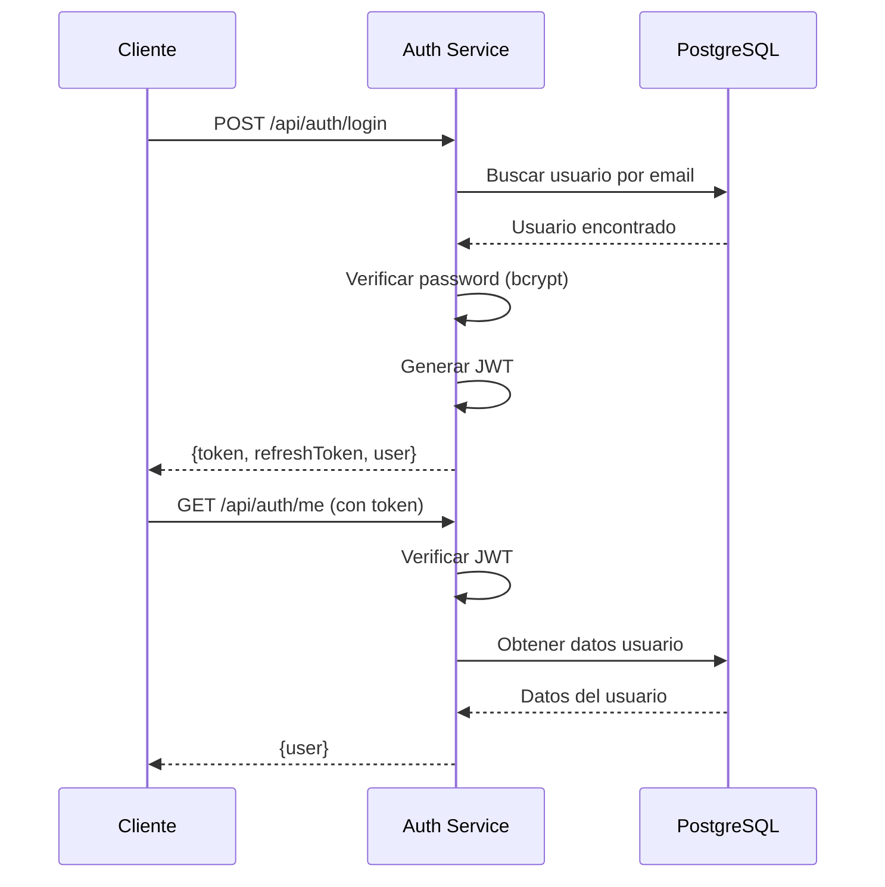

---
tags:
  - servicio
  - backend
  - autenticacion
last_updated: 2026-02-09
puerto: 3001
status: implemented
---

# Auth Service

Microservicio de autenticación y gestión de usuarios para Encore.

## Propósito

Maneja toda la lógica de autenticación, registro, login, y gestión de sesiones mediante JWT (JSON Web Tokens).

## Endpoints Principales

| Método | Ruta | Descripción | Auth Requerido |
|--------|------|-------------|----------------|
| POST | `/api/auth/register` | Registro de nuevo usuario | ❌ No |
| POST | `/api/auth/login` | Login con email/password | ❌ No |
| POST | `/api/auth/refresh` | Refresh de JWT token | ✅ Sí |
| GET | `/api/auth/me` | Obtener perfil del usuario | ✅ Sí |
| POST | `/api/auth/logout` | Cerrar sesión | ✅ Sí |

## Variables de Entorno

```bash
# .env en backend/auth-service/
JWT_SECRET=<tu-secret-key>           # Secreto para firmar tokens
JWT_EXPIRES_IN=7d                    # Expiración del token
REFRESH_TOKEN_EXPIRES_IN=30d         # Expiración del refresh token
DB_HOST=localhost
DB_PORT=5432
DB_NAME=encore_db
DB_USER=postgres
DB_PASSWORD=<password>
```

> [!WARNING] JWT_SECRET Crítico
> En producción, `JWT_SECRET` debe ser una cadena aleatoria de al menos 64 caracteres. NUNCA commitear en el repositorio.

## Stack Tecnológico

- **Framework**: Express.js 4.18.2
- **JWT**: jsonwebtoken 9.0.2
- **Hashing**: Bcrypt (integrado)
- **Database**: [[PostgreSQL]] (cliente pg 8.11.3)
- **Validación**: express-validator 7.0.1

## Flujo de Autenticación



## Dependencias con Otros Servicios

- **[[PostgreSQL]]**: Almacenamiento de usuarios y credenciales
- **Todos los servicios**: Validan tokens JWT generados por Auth Service

> [!INFO] Arquitectura Stateless
> Los tokens JWT son stateless. No se almacenan en base de datos, solo se valida la firma.

## Schemas de Base de Datos

### Tabla `users`

```sql
CREATE TABLE users (
  id SERIAL PRIMARY KEY,
  email VARCHAR(255) UNIQUE NOT NULL,
  password_hash VARCHAR(255) NOT NULL,
  name VARCHAR(255),
  role VARCHAR(50) DEFAULT 'customer',
  created_at TIMESTAMP DEFAULT CURRENT_TIMESTAMP,
  updated_at TIMESTAMP DEFAULT CURRENT_TIMESTAMP
);
```

### Tabla `bars` (para administradores)

```sql
CREATE TABLE bars (
  id SERIAL PRIMARY KEY,
  name VARCHAR(255) NOT NULL,
  owner_id INTEGER REFERENCES users(id),
  is_active BOOLEAN DEFAULT true,
  created_at TIMESTAMP DEFAULT CURRENT_TIMESTAMP
);
```

## Testing

```bash
# Ejecutar tests unitarios
npm run test:unit

# Ejecutar tests de integración
npm run test:integration

# Cobertura
npm run test:coverage
```

## Errores Comunes

| Error | Causa | Solución |
|-------|-------|----------|
| `Invalid credentials` | Password incorrecto | Verificar bcrypt hash |
| `Token expired` | JWT expirado | Usar refresh token |
| `Invalid token` | Token malformado | Regenerar token |

## Referencias

- Mapa de servicios: [[21-Mapa-Servicios]]
- Stack tecnológico: [[11-Stack]]
- Configuración: [[02-Configuracion]]
