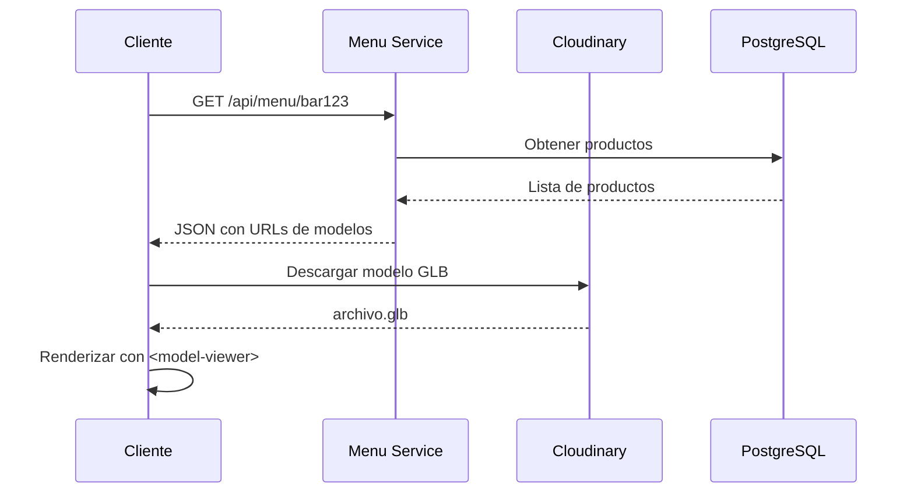

---
tags:
  - servicio
  - backend
  - menu
  - 3d
last_updated: 2026-02-09
puerto: 3005
status: planned
---

# Menu Service

Microservicio para gestión del menú digital 3D con productos y categorías (Planeado).

## Propósito

- Gestionar catálogo de productos (comida/bebidas)
- Servir modelos 3D para visualización
- Control de inventario y disponibilidad
- Precios y categorías

> [!INFO] Visualización 3D
> El menú usa Google `<model-viewer>` para renderizar modelos 3D de productos en formato GLB.

## Endpoints Planeados

| Método | Ruta | Descripción | Auth |
|--------|------|-------------|------|
| GET | `/api/menu/:barId` | Obtener menú del bar | ❌ |
| POST | `/api/menu/products` | Crear producto | ✅ Admin |
| PUT | `/api/menu/products/:id` | Actualizar producto | ✅ Admin |
| DELETE | `/api/menu/products/:id` | Eliminar producto | ✅ Admin |
| GET | `/api/menu/categories` | Listar categorías | ❌ |

## Variables de Entorno (Planeadas)

```bash
# .env en backend/menu-service/
CLOUDINARY_CLOUD_NAME=<cloudinary>
CLOUDINARY_API_KEY=<key>
CLOUDINARY_API_SECRET=<secret>
DB_HOST=localhost
DB_PASSWORD=<password>
```

## Stack Tecnológico

- **Framework**: Express.js 4.18.2
- **Database**: [[PostgreSQL]]
- **Storage**: Cloudinary (modelos 3D + thumbnails)
- **3D Format**: GLB (optimizado para web)

## Modelos 3D

### Formato y Optimización

```yaml
Formato: GLB (Binary glTF)
Tamaño máximo: 2MB por modelo
Texturas: 512x512px (optimizadas)
Polígonos: < 5000 triángulos
Herramientas:
  - gltf-pipeline (CLI optimizer)
  - Meshy AI (generación de modelos)
```

### Integración con model-viewer

```html
<model-viewer
  src="/models/producto-123.glb"
  alt="Modelo 3D del producto"
  auto-rotate
  camera-controls
  ar
  ar-modes="webxr scene-viewer quick-look"
>
</model-viewer>
```

> [!TIP] AR Nativo
> Google model-viewer soporta AR nativo en iOS (Quick Look) y Android (Scene Viewer) sin configuración adicional.

## Schema de Base de Datos (Planeado)

### Tabla `products`

```sql
CREATE TABLE products (
  id SERIAL PRIMARY KEY,
  bar_id INTEGER REFERENCES bars(id),
  name VARCHAR(255) NOT NULL,
  description TEXT,
  price DECIMAL(10, 2) NOT NULL,
  category VARCHAR(100),
  model_url TEXT,          -- URL del modelo GLB
  thumbnail_url TEXT,      -- Imagen 2D del producto
  is_available BOOLEAN DEFAULT true,
  created_at TIMESTAMP DEFAULT CURRENT_TIMESTAMP
);
```

### Tabla `categories`

```sql
CREATE TABLE categories (
  id SERIAL PRIMARY KEY,
  name VARCHAR(100) UNIQUE NOT NULL,
  icon_url TEXT,
  display_order INTEGER
);
```

## Flujo de Visualización 3D



## Generación de Modelos 3D

### Opción 1: Meshy AI (Recomendado)

```bash
# Plan: Pro ($16/mes para 100 modelos)
# Input: Imagen o texto descriptivo
# Output: GLB optimizado automáticamente
```

### Opción 2: Herramientas CLI

```bash
# Optimizar modelo existente
gltf-pipeline -i input.glb -o optimized.glb -d

# Conversión GLTF a GLB
gltf-pipeline -i model.gltf -o model.glb
```

## Dependencias con Otros Servicios

- **[[Auth-Service]]**: Validación de admin para CRUD
- **[[PostgreSQL]]**: Almacenamiento de productos
- **Cloudinary**: Hosting de modelos 3D y thumbnails

## Estado Actual

|Funcionalidad | Estado |
|--------------|--------|
| CRUD de productos | 🔜 Planeado |
| Upload de modelos 3D | 🔜 Planeado |
| Integración Cloudinary | 🔜 Planeado |
| model-viewer frontend | 🔜 Planeado |

## Referencias

- Google model-viewer: https://modelviewer.dev/
- Cloudinary Docs: https://cloudinary.com/documentation
- Stack tecnológico: [[11-Stack]]
- Mapa de servicios: [[21-Mapa-Servicios]]
