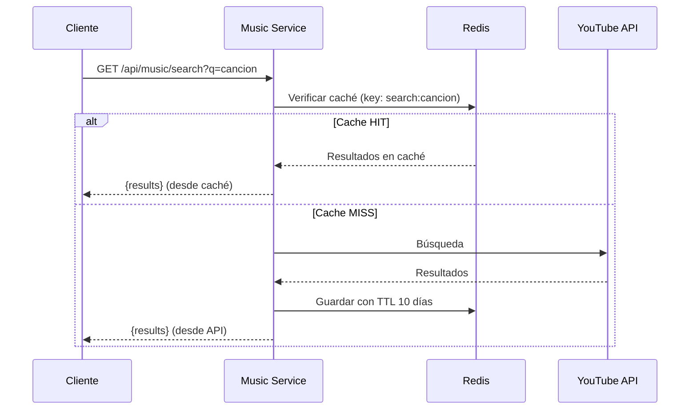

---
tags:
  - servicio
  - backend
  - musica
  - youtube
last_updated: 2026-02-09
puerto: 3002
status: implemented
---

# Music Service

Microservicio encargado de búsqueda de música, integración con APIs externas (YouTube/Spotify) y gestión de caché.

## Propósito

- Buscar canciones via YouTube Data API v3
- Cachear resultados en [[Redis]] para optimizar cuota
- Actuar como proxy hacia [[Queue-Service]]
- Gestionar metadata de canciones

## Endpoints Principales

| Método | Ruta | Descripción | Auth |
|--------|------|-------------|------|
| GET | `/api/music/search` | Buscar canciones | ❌ |
| GET | `/api/music/song/:id` | Obtener metadata de canción | ❌ |
| POST | `/api/queue/:barId/add` | Agregar a cola (proxy) | ✅ |
| GET | `/api/queue/:barId` | Obtener cola (proxy) | ❌ |

## Variables de Entorno

```bash
# .env en backend/music-service/
YOUTUBE_API_KEY=<youtube-api-key>    # YouTube Data API v3
REDIS_HOST=localhost
REDIS_PORT=6379
QUEUE_SERVICE_URL=http://localhost:3003
DB_HOST=localhost
DB_PASSWORD=<password>
```

> [!WARNING] YouTube Quota
> La cuota gratuita de YouTube es **10,000 units/día**. Una búsqueda consume ~100 units. El caché Redis es CRÍTICO para no agotar la cuota.

## Stack Tecnológico

- **Framework**: Express.js 4.18.2
- **YouTube API**: googleapis 165.0.0
- **Redis**: redis 4.6.10 + ioredis 5.7.0
- **HTTP Client**: axios 1.13.2 (para proxy)
- **Validación**: express-validator 7.0.1

## Flujo de Búsqueda con Caché



## Caché Redis

### Estrategia de Caching

```typescript
// Key pattern
const cacheKey = `search:${query.toLowerCase()}`;

// TTL: 10 días (864000 segundos)
await redisClient.setex(cacheKey, 864000, JSON.stringify(results));
```

### Beneficios

- ✅ Reduce 98% de llamadas a YouTube API
- ✅ Respuestas instantáneas (<10ms vs ~200ms)
- ✅ Ahorra cuota diaria

> [!TIP] Monitoreo de Cuota
> Implementar endpoint `/api/music/quota` para ver cuota restante del día.

## Proxy a Queue Service

El Music Service actúa como proxy para simplificar el frontend:

```typescript
// Frontend solo necesita conocer Music Service
POST http://localhost:3002/api/queue/bar123/add

// Music Service reenvía a Queue Service
POST http://localhost:3003/api/queue/add
```

## Dependencias con Otros Servicios

- **[[Redis]]**: Caché de resultados de YouTube
- **[[Queue-Service]]**: Proxy para agregar canciones
- **[[PostgreSQL]]**: Almacenamiento de bares y configuración

## Endpoints del Proxy

| Endpoint Music | Destino Queue | Descripción |
|----------------|---------------|-------------|
| `POST /api/queue/:barId/add` | `POST /api/queue/add` | Agregar canción |
| `GET /api/queue/:barId` | `GET /api/queue/:barId` | Obtener cola |

## Testing

```bash
# Tests del servicio
npm run test

# Validar Phase 1
npm run validate:phase1

# Tests de performance
npm run test:performance
```

## Monitoreo y Logs

```javascript
// Winston logger configurado
log('✅ YouTube search:', { query, results: data.length });
log('❌ YouTube API error:', error.message);
```

## Errores Comunes

| Error | Causa | Solución |
|-------|-------|----------|
| `Quota exceeded` | Cuota YouTube agotada | Esperar 24h o usar Spotify fallback |
| `Redis connection failed` | Redis no disponible | Verificar `REDIS_HOST` |
| `Invalid API key` | `YOUTUBE_API_KEY` incorrecta | Regenerar en Google Cloud Console |

## Referencias

- YouTube Data API: https://developers.google.com/youtube/v3
- Mapa de servicios: [[21-Mapa-Servicios]]
- Stack tecnológico: [[11-Stack]]
- Queue Service: [[Queue-Service]]
