---
tags:
  - servicio
  - backend
  - pagos
  - puntos
last_updated: 2026-02-09
puerto: 3004
status: planned
---

# Points Service

Microservicio para gestión de sistema de puntos, créditos y procesamiento de pagos (Planeado).

## Propósito

- Gestionar saldo de puntos de usuarios
- Procesar compras de créditos
- Integración con Stripe / Mercado Pago
- Canjear puntos por canciones

> [!WARNING] Estado Actual
> Este servicio está **en desarrollo**. La funcionalidad básica de puntos está implementada, pero la integración de pagos está pendiente.

## Endpoints Planeados

| Método | Ruta | Descripción | Auth |
|--------|------|-------------|------|
| GET | `/api/points/:userId` | Obtener saldo | ✅ |
| POST | `/api/points/purchase` | Comprar créditos | ✅ |
| POST | `/api/points/redeem` | Canjear por canción | ✅ |
| GET | `/api/points/history/:userId` | Historial de transacciones | ✅ |

## Variables de Entorno (Planeadas)

```bash
# .env en backend/points-service/
STRIPE_SECRET_KEY=<stripe-key>       # Para pagos internacionales
MERCADOPAGO_ACCESS_TOKEN=<mp-token> # Para Colombia (recomendado)
DB_HOST=localhost
DB_PASSWORD=<password>
JWT_SECRET=<secret>
```

## Stack Tecnológico

- **Framework**: Express.js 4.18.2
- **Pagos (Planeado)**: 
  - Stripe 17.x (internacional)
  - Mercado Pago 2.x (Colombia - preferido)
- **Database**: [[PostgreSQL]]

## Lógica de Puntos

### Costo de Canciones

```typescript
const SONG_COSTS = {
  normal: 10,      // Canción normal (final de cola)
  priority: 25     // Canción prioridad (salta la cola)
};
```

### Ganancia de Puntos

| Acción | Puntos |
|--------|--------|
| Compra $10,000 COP | 100 puntos |
| Primera visita (bonus) | 50 puntos |
| Referir amigo | 25 puntos |

## Flujo de Pago (Planeado)

```mermaid
sequenceDiagram
    participant Cliente
    participant Points Service
    participant Mercado Pago
    participant PostgreSQL
    
    Cliente->>Points Service: POST /api/points/purchase {amount: 10000}
    Points Service->>Mercado Pago: Crear preferencia de pago
    Mercado Pago-->>Points Service: {payment_url}
    Points Service-->>Cliente: Redirigir a Mercado Pago
    
    Cliente->>Mercado Pago: Completa pago
    Mercado Pago->>Points Service: Webhook: pago aprobado
    Points Service->>PostgreSQL: Actualizar saldo usuario
    Points Service-->>Cliente: Notificación de puntos agregados
```



## Schema de Base de Datos (Planeado)

### Tabla `points_transactions`

```sql
CREATE TABLE points_transactions (
  id SERIAL PRIMARY KEY,
  user_id INTEGER REFERENCES users(id),
  amount INTEGER NOT NULL,
  type VARCHAR(50),  -- 'purchase', 'redeem', 'bonus'
  description TEXT,
  created_at TIMESTAMP DEFAULT CURRENT_TIMESTAMP
);
```

### Tabla `user_balances`

```sql
CREATE TABLE user_balances (
  user_id INTEGER PRIMARY KEY REFERENCES users(id),
  balance INTEGER DEFAULT 0,
  updated_at TIMESTAMP DEFAULT CURRENT_TIMESTAMP
);
```

## Dependencias con Otros Servicios

- **[[Auth-Service]]**: Validación de usuario
- **[[Queue-Service]]**: Aplicar puntos al agregar canciones
- **[[PostgreSQL]]**: Almacenamiento de transacciones

## Integración con Mercado Pago (Colombia)

```typescript
import mercadopago from 'mercadopago';

mercadopago.configure({
  access_token: process.env.MERCADOPAGO_ACCESS_TOKEN
});

// Crear preferencia de pago
const preference = {
  items: [{
    title: 'Créditos Encore',
    unit_price: 10000,  // COP
    quantity: 1
  }],
  back_urls: {
    success: 'http://encore.com/payment/success',
    failure: 'http://encore.com/payment/failure'
  }
};
```

> [!TIP] Mercado Pago vs Stripe
> Para Colombia, **Mercado Pago** es preferido porque:
> - Acepta PSE (bancos colombianos)
> - Menores comisiones (3.99% vs 5.4% de Stripe)
> - Interfaz en español

## Estado Actual

| Funcionalidad | Estado |
|---------------|--------|
| Sistema de puntos básico | ✅ Implementado |
| Canjear puntos | ✅ Implementado |
| Integración Stripe | 🔜 Planeado |
| Integración Mercado Pago | 🔜 Planeado |
| Webhooks | 🔜 Planeado |

## Referencias

- Mercado Pago Docs: https://www.mercadopago.com.co/developers
- Stripe Docs: https://stripe.com/docs
- Mapa de servicios: [[21-Mapa-Servicios]]
