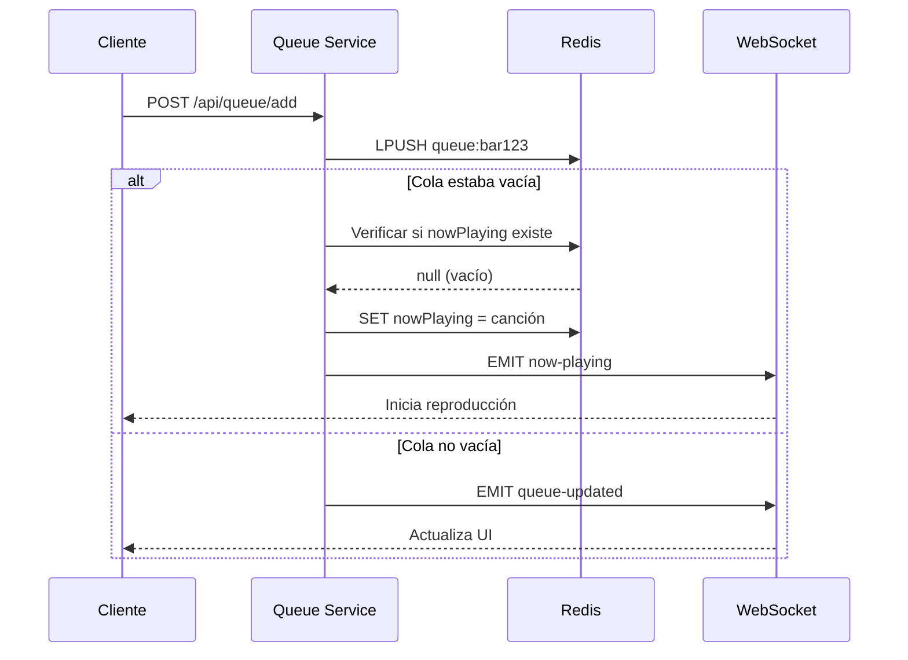

---
tags:
  - servicio
  - backend
  - cola
  - websocket
  - tiempo-real
last_updated: 2026-02-09
puerto: 3003
status: implemented
---

# Queue Service

Microservicio que gestiona la cola de reproducción musical en tiempo real con Socket.IO y Redis.

## Propósito

- Gestionar cola de reproducción por bar/establecimiento
- Emitir eventos WebSocket para sincronización en tiempo real
- Auto-start de canciones cuando la cola está vacía
- Control de "Now Playing" (canción actual)

## Endpoints Principales

| Método | Ruta | Descripción | Auth |
|--------|------|-------------|------|
| POST | `/api/queue/add` | Agregar canción a cola | ✅ |
| GET | `/api/queue/:barId` | Obtener cola del bar | ❌ |
| POST | `/api/queue/:barId/skip` | Saltar canción actual | ✅ Admin |
| DELETE | `/api/queue/:barId/:songId` | Eliminar canción | ✅ Admin |
| GET | `/api/queue/:barId/now-playing` | Canción en reproducción | ❌ |

## Variables de Entorno

```bash
# .env en backend/queue-service/
JWT_SECRET=<mismo-que-auth-service>  # Para validar tokens
REDIS_HOST=localhost
REDIS_PORT=6379
REDIS_KEY_PREFIX=encore:queue:       # Prefijo para keys
PORT=3003
```

## Stack Tecnológico

- **Framework**: Express.js 4.18.2
- **WebSocket**: Socket.IO Server 4.8.1
- **Queue Storage**: [[Redis]] (listas + hashes)
- **Auth**: JWT verification con jsonwebtoken

## Arquitectura de Eventos

### Eventos WebSocket Emitidos

| Evento | Payload | Descripción |
|--------|---------|-------------|
| `queue-updated` | `{barId, queue}` | Cola actualizada |
| `now-playing` | `{barId, song}` | Canción iniciada |
| `song-ended` | `{barId, songId}` | Canción terminada |

### Rooms de Socket.IO

```typescript
// Cliente se une a room del bar
socket.join(`bar:${barId}`);

// Emitir solo a ese bar
io.to(`bar:${barId}`).emit('now-playing', songData);
```

## Flujo de Auto-Start



> [!INFO] Auto-Start Implementado
> Cuando se agrega una canción y la cola está vacía, automáticamente se inicia la reproducción sin intervención del admin.

## Estructura de Datos en Redis

### Cola de Reproducción (Lista)

```redis
# Key: encore:queue:bar123
# Type: LIST (LPUSH para agregar, RPOP para consumir)
[
  {songId: 'abc123', title: 'Canción 1', userId: 'user1'},
  {songId: 'def456', title: 'Canción 2', userId: 'user2'}
]
```

### Now Playing (Hash)

```redis
# Key: encore:queue:bar123:nowPlaying
# Type: HASH
{
  songId: 'abc123',
  title: 'Canción 1',
  artist: 'Artista',
  thumbnail: 'url',
  startedAt: '2026-02-09T20:00:00Z'
}
```

## Dependencias con Otros Servicios

- **[[Music-Service]]**: Proxy requests para agregar canciones
- **[[Redis]]**: Almacenamiento de colas y estado
- **[[Auth-Service]]**: Validación de JWT para acciones admin
- **Frontend**: Conexión WebSocket para tiempo real

## Cliente Socket.IO (Frontend)

```typescript
// Conexión desde el frontend
import io from 'socket.io-client';

const socket = io('http://localhost:3003');

// Unirse a room del bar
socket.emit('join-bar', 'bar123');

// Escuchar eventos
socket.on('now-playing', (data) => {
  console.log('Reproduciendo:', data.song);
  setNowPlayingSong(data.song);
});

socket.on('queue-updated', (data) => {
  console.log('Cola actualizada:', data.queue);
  setQueue(data.queue);
});
```

## Testing

```bash
# Tests del servicio
npm run test

# Test de WebSocket
node test-websocket-connection.js

# Test de flujo completo
node test-queue-flow-complete.js
```

## Comandos Redis Útiles

```bash
# Ver cola de un bar
redis-cli LRANGE encore:queue:bar123 0 -1

# Ver canción actual
redis-cli HGETALL encore:queue:bar123:nowPlaying

# Limpiar cola
redis-cli DEL encore:queue:bar123
```

## Errores Comunes

| Error | Causa | Solución |
|-------|-------|----------|
| `WebSocket disconnection` | Redis no disponible | Verificar Redis running |
| `Unauthorized` | JWT inválido | Verificar `JWT_SECRET` |
| `Queue not found` | Bar no existe | Crear bar primero |

## Referencias

- Socket.IO Docs: https://socket.io/docs/v4/
- Mapa de servicios: [[21-Mapa-Servicios]]
- Music Service: [[Music-Service]]
- Redis: [[Redis]]
